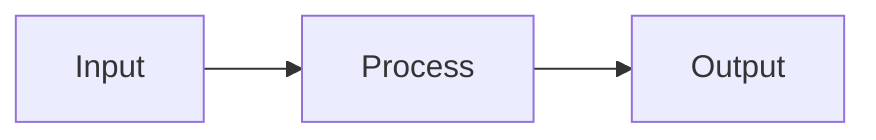

# Contributing to semdocs

Thank you for helping improve the SemStreams ecosystem documentation!

## 📝 Documentation Standards

### Content Guidelines

1. **Focus**: Document WHAT and WHY, not HOW (implementation details belong in service repos)
2. **Audience**: Users, integrators, and ecosystem developers (not just contributors)
3. **Clarity**: Write for developers new to SemStreams
4. **Examples**: Include code examples, diagrams, and real-world use cases

### File Organization

```
docs/
├── getting-started/    # Onboarding, quickstart, concepts
├── guides/             # Feature guides (PathRAG, federation, etc.)
├── integration/        # API contracts, event schemas
├── deployment/         # Production setup, operations
├── reference/          # Technical specifications
└── development/        # Contributing, testing, agents
```

### Writing Style

- **Use active voice**: "The service processes events" not "Events are processed"
- **Be concise**: Short sentences, clear paragraphs
- **Code blocks**: Always specify language for syntax highlighting
- **Links**: Use relative links for internal docs, absolute for external
- **Headers**: Single `#` for title, `##` for sections (no skipping levels)
- **Line length**: Max 120 characters for readability

### Markdown Standards

```markdown
# Document Title

Brief introduction (1-2 sentences).

## Section Heading

Content with examples:

```bash
# Code example with language tag
npm install semstreams
```

**Bold** for emphasis, *italic* for technical terms on first use.

- Bulleted lists for items
- Consistent formatting

1. Numbered lists for steps
2. Sequential instructions

## See Also

- [Related Guide](./related-guide.md)
- [External Resource](https://example.com)
```

## 🔧 Making Changes

### Small Fixes (Typos, Clarifications)

1. Fork the repository
2. Make your changes
3. Submit a pull request

### New Documentation

1. **Check existing docs** to avoid duplication
2. **Create an issue** describing what you want to add
3. **Get feedback** before writing extensive content
4. **Submit PR** with your new documentation

### Updating for New Features

When adding new SemStreams features:

1. Update relevant guide docs
2. Add integration examples if applicable
3. Update API reference if needed
4. Link from README if it's a major feature

## ✅ Quality Checklist

Before submitting:

- [ ] Spell-checked and grammar-checked
- [ ] Code examples tested and working
- [ ] All links verified (no 404s)
- [ ] Follows file organization standards
- [ ] Markdown linting passes (`markdownlint`)
- [ ] Images optimized (if any)
- [ ] Cross-referenced related docs

## 📋 Documentation Types

### Getting Started

**Purpose**: Help new users get up and running quickly

**Include**:
- Prerequisites
- Installation steps
- First working example
- Next steps

**Avoid**:
- Deep technical details
- Implementation specifics
- Advanced configurations

### Guides

**Purpose**: Explain how to use specific features

**Include**:
- Feature overview
- Common use cases
- Step-by-step examples
- Troubleshooting

**Avoid**:
- Exhaustive API documentation (use reference instead)
- Implementation internals

### Integration

**Purpose**: Show how to integrate with SemStreams

**Include**:
- API contracts (GraphQL, REST, events)
- Example requests/responses
- Client library examples
- Error handling

**Avoid**:
- Service implementation details

### Reference

**Purpose**: Complete technical specifications

**Include**:
- Full API schemas
- Configuration options
- Vocabulary specifications
- Version compatibility

**Avoid**:
- Tutorials or guides (link to guides instead)

## 🖼️ Diagrams and Images

**Use Mermaid for diagrams** (renders in GitHub):

```markdown

```

**For screenshots**:
- PNG format, optimized
- Max width: 800px
- Store in `/docs/images/`
- Use descriptive filenames: `flow-builder-validation.png`

## 🔗 Links

**Internal links** (relative):
```markdown
[Guide](../guides/pathrag.md)
```

**External links** (absolute):
```markdown
[NATS JetStream](https://docs.nats.io/nats-concepts/jetstream)
```

**Anchor links**:
```markdown
[Section](#section-heading)
```

## 🎯 Examples

### Good Example

```markdown
## Creating a Processing Flow

A flow defines how data moves through SemStreams components.

**Quick Example:**

```bash
curl -X POST http://localhost:8080/api/flows \
  -H "Content-Type: application/json" \
  -d '{
    "name": "Sensor Processing",
    "components": [...]
  }'
```

This creates a flow that:
1. Receives sensor data via UDP
2. Parses JSON messages
3. Publishes to NATS

**See**: [Flow Configuration](../reference/flow-config.md) for all options.
```

### Bad Example

```markdown
## Flows

You can make flows. Here's how:

[lots of implementation details about the Go code]

Also you need to configure NATS and set up the database and...
```

## 🚀 Publishing

Documentation is automatically deployed when merged to `main`:
- GitHub Pages: https://c360.github.io/semdocs (if configured)
- Netlify: https://semdocs.netlify.app (if configured)

## ❓ Questions?

- **General questions**: [Discussions](https://github.com/c360/semdocs/discussions)
- **Bug reports**: [Issues](https://github.com/c360/semdocs/issues)
- **SemStreams questions**: [SemStreams Discussions](https://github.com/c360/semstreams/discussions)

Thank you for contributing to SemStreams documentation!
