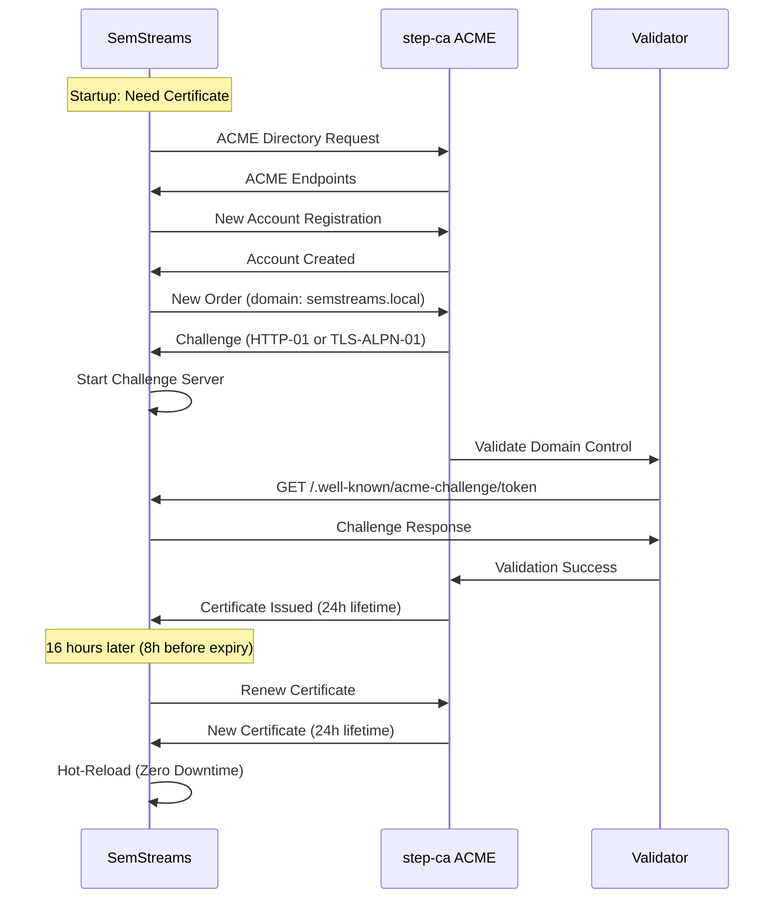

# ACME Setup Guide: Automated Certificate Management

Comprehensive guide to deploying and configuring automated PKI for SemStreams using ACME
protocol and step-ca certificate authority.

## What is ACME?

**ACME** (Automatic Certificate Management Environment) is a protocol for automating certificate
lifecycle management, originally developed for Let's Encrypt. It eliminates manual certificate
generation, distribution, and renewal.

**How It Works**:

1. **Certificate Request**: Application requests certificate from ACME server
2. **Domain Validation**: ACME server proves applicant controls the domain (HTTP-01 or TLS-ALPN-01)
3. **Certificate Issuance**: ACME server issues short-lived certificate
4. **Automatic Renewal**: Application renews certificate before expiry (no human intervention)

**SemStreams ACME Architecture**:



## When to Use ACME (Tier 3)

SemStreams implements a three-tier security model. Use Tier 3 when:

### Tier 3 Is Right For You

**Deployment Scale**: 3+ locations with federated communication

**Break-Even Analysis**:

| Locations | Manual TLS (Tier 2) | ACME (Tier 3) | Winner |
|-----------|---------------------|---------------|--------|
| 1-2 | 4h setup + 8h/year renewal | 16h setup + 2h/year monitoring | **Tier 2** |
| 3-5 | 12h setup + 24h/year renewal | 16h setup + 2h/year monitoring | **Tier 3** |
| 6+ | 24h setup + 48h/year renewal | 16h setup + 2h/year monitoring | **Tier 3** |

**Operational Benefits**:

- **Set-and-Forget**: No manual certificate renewals (automated every 16 hours)
- **Short Lifetimes**: 24-hour certificates eliminate revocation infrastructure
- **Federation Ready**: Automatic trust distribution across locations
- **Audit Trail**: Complete certificate issuance history in step-ca logs

**Complexity Trade-Off**:

- **Higher Initial Setup**: step-ca deployment, ACME provisioner configuration
- **Lower Ongoing Maintenance**: Automated renewal vs manual quarterly rotation
- **Infrastructure Dependency**: Requires running step-ca service

### Tier 2 Is Right For You

**Deployment Scale**: 1-2 locations, existing corporate PKI

**When to Choose Manual TLS**:

- Small deployment where automation overhead exceeds manual effort
- Corporate PKI already exists (issue SemStreams certs from existing CA)
- Air-gapped networks with no internet access
- Regulatory requirements for long-lived certificates (90-365 days)

**See**: [TLS_SETUP.md](TLS_SETUP.md) for Tier 2 manual certificate configuration

## Prerequisites

Before deploying step-ca:

### Infrastructure

1. **Docker or Kubernetes**: Container orchestration for step-ca
2. **DNS Resolution**: step-ca hostname resolvable by SemStreams instances
3. **Network Access**: Port 9000 (HTTPS) accessible from SemStreams
4. **Storage**: Persistent volume for step-ca state (certificates, accounts, config)

### Security

1. **Admin Password**: Strong password for step-ca admin API (provisioner management)
2. **Root CA Planning**: Decide between self-signed root or corporate root
3. **Backup Strategy**: step-ca state backup and recovery procedure

### Planning

1. **Certificate Lifetimes**: Default 24h for edge, customize if needed
2. **ACME Challenge Type**: HTTP-01 (port 80) or TLS-ALPN-01 (port 443)
3. **Domain Names**: DNS entries for SemStreams instances (e.g., `semstreams-a.local`)

## step-ca Deployment

### Option 1: Docker Compose (Recommended for Development)

**File**: `docker-compose.step-ca.yml`

```yaml
version: '3.8'

services:
  step-ca:
    image: smallstep/step-ca:latest
    container_name: semstreams-step-ca
    hostname: step-ca.local
    restart: unless-stopped

    ports:
      - "9000:9000"  # HTTPS API + ACME directory

    environment:
      # CA initialization (only used on first startup)
      - DOCKER_STEPCA_INIT_NAME=SemStreams Internal CA
      - DOCKER_STEPCA_INIT_DNS_NAMES=step-ca.local,step-ca,localhost
      - DOCKER_STEPCA_INIT_PROVISIONER_NAME=acme
      - DOCKER_STEPCA_INIT_ADMIN_SUBJECT=admin@example.com

      # Certificate lifetimes
      - DOCKER_STEPCA_INIT_DEFAULT_CERT_VALIDITY=24h
      - DOCKER_STEPCA_INIT_PASSWORD=${STEP_CA_PASSWORD:-changeme}

    volumes:
      # Persistent storage for CA state
      - step-ca-data:/home/step

      # Optional: Mount custom root CA (for federation)
      # - ./certs/root-ca.crt:/home/step/certs/root_ca.crt:ro
      # - ./secrets/root-ca-key.pem:/home/step/secrets/root_ca_key:ro

    healthcheck:
      test: ["CMD", "step", "ca", "health"]
      interval: 10s
      timeout: 5s
      retries: 5
      start_period: 10s

    networks:
      - semstreams

volumes:
  step-ca-data:
    driver: local

networks:
  semstreams:
    driver: bridge
```

**Start step-ca**:

```bash
# Set admin password (avoid default)
export STEP_CA_PASSWORD="your-secure-password"

# Start step-ca
docker compose -f docker-compose.step-ca.yml up -d

# Wait for initialization (30-60 seconds on first start)
docker compose -f docker-compose.step-ca.yml logs -f

# Look for:
# Serving HTTPS on :9000 ...
```

**Verify Deployment**:

```bash
# Check health
docker exec semstreams-step-ca step ca health
# Expected: ok

# Test ACME directory endpoint
curl -k https://localhost:9000/acme/acme/directory
# Expected: JSON with ACME endpoints (newNonce, newAccount, newOrder, etc.)

# Retrieve root CA certificate (for distribution to clients)
docker exec semstreams-step-ca step ca root > step-ca-root.crt
```

### Option 2: Kubernetes Deployment

**File**: `k8s/step-ca.yaml`

```yaml
apiVersion: v1
kind: Namespace
metadata:
  name: semstreams-pki

---
apiVersion: v1
kind: Secret
metadata:
  name: step-ca-password
  namespace: semstreams-pki
type: Opaque
stringData:
  password: your-secure-password

---
apiVersion: v1
kind: PersistentVolumeClaim
metadata:
  name: step-ca-data
  namespace: semstreams-pki
spec:
  accessModes:
    - ReadWriteOnce
  resources:
    requests:
      storage: 10Gi

---
apiVersion: apps/v1
kind: Deployment
metadata:
  name: step-ca
  namespace: semstreams-pki
spec:
  replicas: 1  # Note: step-ca is not HA-ready (single-instance only)
  selector:
    matchLabels:
      app: step-ca
  template:
    metadata:
      labels:
        app: step-ca
    spec:
      containers:
      - name: step-ca
        image: smallstep/step-ca:latest
        ports:
        - containerPort: 9000
          name: https
        env:
        - name: DOCKER_STEPCA_INIT_NAME
          value: "SemStreams Internal CA"
        - name: DOCKER_STEPCA_INIT_DNS_NAMES
          value: "step-ca.semstreams-pki.svc.cluster.local,step-ca,localhost"
        - name: DOCKER_STEPCA_INIT_PROVISIONER_NAME
          value: "acme"
        - name: DOCKER_STEPCA_INIT_DEFAULT_CERT_VALIDITY
          value: "24h"
        - name: DOCKER_STEPCA_INIT_PASSWORD
          valueFrom:
            secretKeyRef:
              name: step-ca-password
              key: password
        volumeMounts:
        - name: step-ca-data
          mountPath: /home/step
        livenessProbe:
          exec:
            command:
            - step
            - ca
            - health
          initialDelaySeconds: 30
          periodSeconds: 10
        readinessProbe:
          exec:
            command:
            - step
            - ca
            - health
          initialDelaySeconds: 10
          periodSeconds: 5
      volumes:
      - name: step-ca-data
        persistentVolumeClaim:
          claimName: step-ca-data

---
apiVersion: v1
kind: Service
metadata:
  name: step-ca
  namespace: semstreams-pki
spec:
  type: ClusterIP
  selector:
    app: step-ca
  ports:
  - port: 9000
    targetPort: 9000
    name: https
```

**Deploy to Kubernetes**:

```bash
# Create namespace and deploy step-ca
kubectl apply -f k8s/step-ca.yaml

# Wait for pod ready
kubectl wait --for=condition=ready pod -l app=step-ca -n semstreams-pki --timeout=120s

# Verify health
kubectl exec -n semstreams-pki deployment/step-ca -- step ca health

# Retrieve root CA for distribution
kubectl exec -n semstreams-pki deployment/step-ca -- step ca root > step-ca-root.crt
```

**Expose step-ca** (if SemStreams runs outside cluster):

```yaml
apiVersion: v1
kind: Service
metadata:
  name: step-ca-external
  namespace: semstreams-pki
spec:
  type: LoadBalancer  # or NodePort
  selector:
    app: step-ca
  ports:
  - port: 9000
    targetPort: 9000
```

### Option 3: Bare Metal Installation

**Install step-ca binary**:

```bash
# Download and install step-ca
wget https://dl.step.sm/gh-release/certificates/gh-release-header/v0.25.0/step-ca_linux_0.25.0_amd64.tar.gz
tar -xzf step-ca_linux_0.25.0_amd64.tar.gz
sudo mv step-ca_0.25.0/bin/step-ca /usr/local/bin/

# Install step CLI (for management)
wget https://dl.step.sm/gh-release/cli/gh-release-header/v0.25.0/step_linux_0.25.0_amd64.tar.gz
tar -xzf step_linux_0.25.0_amd64.tar.gz
sudo mv step_0.25.0/bin/step /usr/local/bin/
```

**Initialize step-ca**:

```bash
# Create step-ca user
sudo useradd -r -s /bin/false step

# Initialize CA
sudo -u step step ca init \
  --name="SemStreams Internal CA" \
  --dns="step-ca.local,localhost" \
  --address=":9000" \
  --provisioner="acme" \
  --deployment-type=standalone

# Follow prompts:
# - Password for CA keys: <set strong password>
# - Default provisioner: acme (ACME protocol)
```

**Create systemd service**:

```bash
# /etc/systemd/system/step-ca.service
cat > /etc/systemd/system/step-ca.service << 'EOF'
[Unit]
Description=step-ca Certificate Authority
After=network.target

[Service]
Type=simple
User=step
WorkingDirectory=/home/step
ExecStart=/usr/local/bin/step-ca /home/step/.step/config/ca.json
Restart=on-failure
RestartSec=10

[Install]
WantedBy=multi-user.target
EOF

# Enable and start service
sudo systemctl daemon-reload
sudo systemctl enable step-ca
sudo systemctl start step-ca

# Verify running
sudo systemctl status step-ca
step ca health
```

## ACME Provisioner Configuration

step-ca initializes with a default ACME provisioner. Customize if needed:

### View Existing Provisioners

```bash
# List all provisioners
docker exec semstreams-step-ca step ca provisioner list

# Expected output:
# {
#   "name": "acme",
#   "type": "ACME",
#   "claims": {
#     "defaultTLSCertDuration": "24h",
#     "maxTLSCertDuration": "48h"
#   }
# }
```

### Customize Certificate Lifetimes

```bash
# Access step-ca container
docker exec -it semstreams-step-ca /bin/sh

# Update ACME provisioner with custom lifetimes
step ca provisioner update acme \
  --x509-default-dur=24h \
  --x509-max-dur=168h

# Restart step-ca to apply changes
exit
docker restart semstreams-step-ca
```

### Add Multiple ACME Provisioners

Useful for different certificate profiles (short-lived edge, longer-lived cloud):

```bash
# Add second ACME provisioner for cloud (48h lifetime)
docker exec semstreams-step-ca step ca provisioner add acme-cloud \
  --type ACME \
  --x509-default-dur=48h

# Verify both provisioners exist
docker exec semstreams-step-ca step ca provisioner list

# Use different provisioner in SemStreams config:
# "directory_url": "https://step-ca:9000/acme/acme-cloud/directory"
```

### Enable Challenge Types

ACME supports two challenge types for domain validation:

**HTTP-01** (default):

- Validator makes HTTP request to `http://domain/.well-known/acme-challenge/token`
- Requires port 80 accessible
- Best for: standard deployments, VMs, containers

**TLS-ALPN-01**:

- Validator makes TLS handshake to `https://domain:443` with ALPN extension
- Requires port 443 accessible
- Best for: environments where port 80 blocked, TLS-only infrastructure

```bash
# ACME provisioner supports both by default
# Select in SemStreams configuration:
"challenge_type": "http-01"    # or "tls-alpn-01"
```

## SemStreams ACME Configuration

### Server-Side ACME

For WebSocket outputs or HTTP servers that need TLS:

```json
{
  "components": [
    {
      "id": "websocket-server",
      "type": "websocket_output",
      "config": {
        "port": 8080,
        "path": "/data"
      }
    }
  ],
  "security": {
    "tls": {
      "server": {
        "enabled": true,
        "mode": "acme",
        "min_version": "1.2",

        "acme": {
          "enabled": true,
          "directory_url": "https://step-ca.local:9000/acme/acme/directory",
          "email": "admin@example.com",
          "domains": ["semstreams-server.local"],
          "challenge_type": "http-01",
          "renew_before": "8h",
          "storage_path": "/data/acme-certs",
          "ca_bundle": "/certs/step-ca-root.crt"
        },

        "mtls": {
          "enabled": false
        }
      }
    }
  }
}
```

**Field Reference**:

| Field | Type | Required | Default | Description |
|-------|------|----------|---------|-------------|
| `enabled` | boolean | Yes | - | Enable ACME automation |
| `directory_url` | string | Yes | - | ACME directory endpoint (step-ca URL) |
| `email` | string | Yes | - | Contact email for ACME account |
| `domains` | string[] | Yes | - | Domain names for certificate (must be resolvable) |
| `challenge_type` | string | No | `"http-01"` | Challenge type (`"http-01"` or `"tls-alpn-01"`) |
| `renew_before` | string | No | `"8h"` | Renew when remaining lifetime < this (duration string) |
| `storage_path` | string | Yes | - | Directory for ACME state (account, certificates) |
| `ca_bundle` | string | No | System CA | CA certificate to trust for step-ca HTTPS |

**How It Works**:

1. **Startup**: SemStreams checks `storage_path` for existing certificate
2. **Obtainment**: If no certificate, requests from ACME server via HTTP-01/TLS-ALPN-01
3. **Hot-Load**: Certificate loaded into TLS configuration
4. **Background Renewal**: Every 1 hour, checks if renewal needed (remaining < `renew_before`)
5. **Renewal**: If needed, requests new certificate and hot-reloads without downtime
6. **Fallback**: If ACME fails and manual `cert_file`/`key_file` configured, uses manual certs

**Example Logs** (startup):

```
INFO Initializing ACME client directory=https://step-ca.local:9000/acme/acme/directory
INFO ACME account loaded from storage email=admin@example.com
INFO Checking existing certificate domain=semstreams-server.local
INFO Certificate valid, no renewal needed expiry=2025-11-16T10:00:00Z remaining=16h
INFO TLS server started with ACME certificate port=8080
INFO Background renewal loop started check_interval=1h
```

### Client-Side ACME

For WebSocket inputs or HTTP clients that need mTLS client certificates:

```json
{
  "components": [
    {
      "id": "websocket-client",
      "type": "websocket_input",
      "config": {
        "url": "wss://semstreams-server.local:8080/data"
      }
    }
  ],
  "security": {
    "tls": {
      "client": {
        "mode": "acme",
        "ca_files": ["/certs/step-ca-root.crt"],
        "min_version": "1.2",

        "acme": {
          "enabled": true,
          "directory_url": "https://step-ca.local:9000/acme/acme/directory",
          "email": "admin@example.com",
          "domains": ["semstreams-client.local"],
          "challenge_type": "http-01",
          "renew_before": "8h",
          "storage_path": "/data/acme-certs-client"
        }
      }
    }
  }
}
```

**Use Cases**:

- **mTLS Client Authentication**: Server requires client certificate for zero-trust
- **Federated Communication**: Multiple SemStreams instances with mutual authentication
- **Client Certificate for API Access**: External APIs requiring client certs

### Configuration Reference

Complete field reference for ACME configuration:

```json
{
  "security": {
    "tls": {
      "server": {
        "enabled": true,
        "mode": "acme",
        "cert_file": "/certs/fallback-server.crt",
        "key_file": "/certs/fallback-server.key",
        "min_version": "1.2",

        "acme": {
          "enabled": true,
          "directory_url": "https://step-ca:9000/acme/acme/directory",
          "email": "admin@example.com",
          "domains": ["semstreams.local", "semstreams.example.com"],
          "challenge_type": "http-01",
          "renew_before": "8h",
          "storage_path": "/data/acme",
          "ca_bundle": "/certs/step-ca-root.crt"
        },

        "mtls": {
          "enabled": true,
          "client_ca_files": ["/certs/federation-root-ca.crt"],
          "require_client_cert": true,
          "allowed_client_cns": ["authorized-client.local"]
        }
      },

      "client": {
        "mode": "acme",
        "ca_files": ["/certs/step-ca-root.crt"],
        "insecure_skip_verify": false,
        "min_version": "1.2",

        "acme": {
          "enabled": true,
          "directory_url": "https://step-ca:9000/acme/acme/directory",
          "email": "client@example.com",
          "domains": ["semstreams-client.local"],
          "challenge_type": "http-01",
          "renew_before": "8h",
          "storage_path": "/data/acme-client"
        }
      }
    }
  }
}
```

**Fallback Behavior**:

- If `cert_file`/`key_file` configured alongside ACME, used as fallback
- If ACME obtainment fails and fallback exists, uses manual certificate
- If ACME renewal fails, continues using existing certificate until expiry
- Logs warnings when operating in fallback mode

## Challenge Types

ACME requires proving domain control before issuing certificates.

### HTTP-01 Challenge

**How It Works**:

1. SemStreams requests certificate for `semstreams.local`
2. step-ca responds with challenge token
3. SemStreams starts HTTP server on port 80 serving token at `/.well-known/acme-challenge/TOKEN`
4. step-ca validator makes HTTP request to `http://semstreams.local/.well-known/acme-challenge/TOKEN`
5. Validation succeeds, certificate issued

**Requirements**:

- Port 80 accessible from step-ca to SemStreams
- DNS resolution: `semstreams.local` resolves to SemStreams IP
- No conflicting HTTP server on port 80

**Configuration**:

```json
{
  "acme": {
    "challenge_type": "http-01",
    "domains": ["semstreams.local"]
  }
}
```

**Pros**:

- Simple, widely supported
- Works with any HTTP-capable infrastructure
- Easy to debug (curl the challenge URL)

**Cons**:

- Requires port 80 open (may conflict with web servers)
- HTTP-only validation (not HTTPS)

### TLS-ALPN-01 Challenge

**How It Works**:

1. SemStreams requests certificate for `semstreams.local`
2. step-ca responds with challenge token
3. SemStreams creates self-signed certificate embedding challenge
4. SemStreams starts TLS server on port 443 with ALPN protocol `acme-tls/1`
5. step-ca validator makes TLS connection to `https://semstreams.local:443` with ALPN
6. Validation succeeds, certificate issued

**Requirements**:

- Port 443 accessible from step-ca to SemStreams
- DNS resolution: `semstreams.local` resolves to SemStreams IP
- No conflicting TLS server on port 443 during validation

**Configuration**:

```json
{
  "acme": {
    "challenge_type": "tls-alpn-01",
    "domains": ["semstreams.local"]
  }
}
```

**Pros**:

- Works when port 80 blocked or unavailable
- TLS-based validation (consistent with certificate use)
- No HTTP server required

**Cons**:

- Port 443 must be available during challenge (conflicts with production TLS server)
- More complex to debug than HTTP-01

**Recommendation**: Use HTTP-01 unless port 80 unavailable.

## Certificate Lifecycle

### Initial Obtainment

**First Startup** (no existing certificate):

1. SemStreams initializes ACME client with `directory_url`
2. Loads or creates ACME account (stored in `storage_path/account.json`)
3. Checks `storage_path/certificate.pem` - not found
4. Initiates certificate order for `domains`
5. Starts challenge server (HTTP on port 80 or TLS on port 443)
6. Waits for step-ca validation
7. Receives certificate, saves to `storage_path/certificate.pem` and `.key`
8. Loads certificate into TLS configuration
9. Starts normal operation with TLS enabled
10. Background renewal loop begins

**Logs** (initial obtainment):

```
INFO ACME account created email=admin@example.com account_url=https://step-ca:9000/acme/acme/account/xyz
INFO Starting certificate obtainment domains=["semstreams.local"]
INFO HTTP-01 challenge server started port=80
INFO Waiting for ACME validation
INFO Certificate obtained successfully domain=semstreams.local expiry=2025-11-16T10:00:00Z
INFO Certificate saved to storage path=/data/acme/certificate.pem
INFO TLS server started with ACME certificate
```

**Timeline**: 5-15 seconds for initial obtainment (includes validation round-trip)

### Automatic Renewal

**Renewal Trigger**:

- Background loop checks certificate expiry every 1 hour
- Renewal triggered when remaining lifetime < `renew_before` (default 8 hours)
- For 24-hour certificates with `renew_before: "8h"`, renews at 16 hours remaining

**Renewal Process**:

1. Background goroutine wakes up (every 1 hour)
2. Checks certificate in `storage_path/certificate.pem`
3. Parses certificate, extracts `NotAfter` timestamp
4. Calculates remaining lifetime: `NotAfter - now()`
5. If `remaining < renew_before`, initiates renewal
6. Requests new certificate from step-ca (using existing ACME account)
7. Receives new certificate
8. Saves to `storage_path/certificate.pem` (overwrites old)
9. **Hot-reloads** certificate into active TLS configuration
10. Existing connections continue (no disruption)
11. New connections use new certificate

**Logs** (successful renewal):

```
INFO Certificate renewal check starting
INFO Certificate eligible for renewal remaining=7h45m renew_before=8h
INFO Starting certificate renewal domain=semstreams.local
INFO Certificate renewed successfully new_expiry=2025-11-17T10:00:00Z
INFO Hot-reloaded certificate path=/data/acme/certificate.pem
INFO Certificate renewal complete next_check=1h
```

**Timeline**: 5-10 seconds for renewal (no downtime)

**Failure Handling**:

- If renewal fails (network error, step-ca down), logs error and retries in 1 hour
- Continues using existing certificate until expiry
- Alerts should trigger if certificate expiry < 2 hours (renewal failing for 6+ hours)

### Hot-Reload Mechanism

SemStreams implements zero-downtime certificate reloads:

**Go Implementation** (from `pkg/tlsutil/tlsutil.go`):

```go
// Background renewal loop
go func() {
    defer close(renewalDone)
    _ = acmeClient.StartRenewalLoop(renewalCtx, 1*time.Hour,
        func(newCert *tls.Certificate) {
            // Hot-reload certificate WITHOUT restarting server
            tlsConfig.Certificates = []tls.Certificate{*newCert}
        })
}()
```

**How It Works**:

1. `tls.Config` uses a **slice** of certificates (`Certificates []tls.Certificate`)
2. Go's `crypto/tls` package re-reads this slice on each TLS handshake
3. Updating the slice atomically replaces the certificate
4. In-flight connections use old certificate until completion
5. New connections use new certificate immediately

**Result**: Zero downtime, no connection drops, seamless rotation

## Monitoring

### Certificate Expiry Tracking

**Manual Checks**:

```bash
# Check certificate expiry from filesystem
openssl x509 -in /data/acme/certificate.pem -noout -dates

# Expected output:
# notBefore=Nov 15 10:00:00 2025 GMT
# notAfter=Nov 16 10:00:00 2025 GMT  # 24 hours later

# Check certificate expiry from network
openssl s_client -connect semstreams.local:8080 2>/dev/null | \
  openssl x509 -noout -dates
```

**Prometheus Metrics** (if observability enabled):

```promql
# Time until certificate expiry (seconds)
semstreams_certificate_expiry_timestamp_seconds - time()

# Alert if expiry < 2 hours (renewal failing)
ALERT CertificateExpiringSoon
  IF (semstreams_certificate_expiry_timestamp_seconds - time()) < 7200
  FOR 10m
  ANNOTATIONS {
    summary = "Certificate expiring in < 2 hours",
    description = "ACME renewal has failed for 6+ hours"
  }
```

### Renewal Success Rate

**Log Analysis**:

```bash
# Count successful renewals in last 24 hours
docker logs semstreams-a 2>&1 | \
  grep "Certificate renewed successfully" | \
  grep -c "$(date +%Y-%m-%d)"

# Expected: 1 renewal per day (every 16 hours with 24h lifetime)
```

**Prometheus Metrics**:

```promql
# Renewal success counter
rate(semstreams_acme_renewal_success_total[24h])

# Renewal failure counter
rate(semstreams_acme_renewal_failure_total[24h])

# Success rate (should be ~100%)
sum(rate(semstreams_acme_renewal_success_total[24h])) /
  (sum(rate(semstreams_acme_renewal_success_total[24h])) +
   sum(rate(semstreams_acme_renewal_failure_total[24h])))
```

### ACME Server Health

**step-ca Health Check**:

```bash
# Check step-ca responsive
curl -k https://step-ca.local:9000/health

# Expected: {"status":"ok"}

# Check ACME directory accessible
curl -k https://step-ca.local:9000/acme/acme/directory

# Expected: JSON with newNonce, newAccount, newOrder endpoints
```

**Docker Health**:

```bash
# Check step-ca container health
docker ps --filter name=step-ca --format "table {{.Names}}\t{{.Status}}"

# Expected: Up X hours (healthy)
```

**Kubernetes Health**:

```bash
# Check step-ca pod health
kubectl get pods -n semstreams-pki -l app=step-ca

# Expected: READY 1/1, STATUS Running
```

## Troubleshooting

### Common Issues

#### Issue: "failed to connect to ACME server"

**Symptom**: SemStreams logs show connection refused to `directory_url`

**Diagnosis**:

```bash
# Test ACME directory reachable from SemStreams
docker exec semstreams-a curl -k https://step-ca.local:9000/acme/acme/directory

# Check DNS resolution
docker exec semstreams-a nslookup step-ca.local

# Check network connectivity
docker exec semstreams-a ping -c 3 step-ca.local
```

**Possible Causes**:

1. step-ca not running
2. DNS not resolving `step-ca.local`
3. Firewall blocking port 9000
4. Wrong `directory_url` in configuration

**Resolution**:

```bash
# Verify step-ca running
docker ps | grep step-ca

# Add DNS entry if missing (Docker Compose)
networks:
  semstreams:
    driver: bridge
# Containers automatically get hostname resolution

# Add to /etc/hosts if needed
echo "192.168.1.100 step-ca.local" >> /etc/hosts

# Verify correct URL in config
grep directory_url /etc/semstreams/config.json
```

#### Issue: "HTTP-01 challenge failed"

**Symptom**: ACME obtainment fails with "challenge validation failed"

**Diagnosis**:

```bash
# Check if port 80 is accessible
docker exec semstreams-a netstat -tuln | grep :80

# Test challenge server manually
curl http://semstreams.local/.well-known/acme-challenge/test

# Check step-ca can reach SemStreams
docker exec step-ca curl -I http://semstreams.local:80
```

**Possible Causes**:

1. Port 80 already in use by another service
2. DNS not resolving `domains` to SemStreams IP
3. Firewall blocking port 80 from step-ca to SemStreams
4. Wrong domain name in configuration

**Resolution**:

```bash
# Use TLS-ALPN-01 instead (port 443)
# In config.json:
"challenge_type": "tls-alpn-01"

# Verify DNS resolves correctly
nslookup semstreams.local
# Should point to SemStreams IP

# Check firewall rules
iptables -L -n | grep 80  # Allow port 80
```

#### Issue: "certificate signed by unknown authority"

**Symptom**: Client connecting to SemStreams gets TLS handshake error

**Diagnosis**:

```bash
# Test server certificate chain
openssl s_client -connect semstreams.local:8080 -showcerts

# Look for:
# Verify return code: 21 (unable to verify the first certificate)

# Check what CA signed the certificate
openssl s_client -connect semstreams.local:8080 2>/dev/null | \
  openssl x509 -noout -issuer
```

**Possible Causes**:

1. Client doesn't trust step-ca root CA
2. `ca_bundle` not configured in client TLS config
3. step-ca using self-signed intermediate not distributed to clients

**Resolution**:

```bash
# Retrieve step-ca root CA
docker exec semstreams-step-ca step ca root > step-ca-root.crt

# Add to client configuration
# In client config.json:
"client": {
  "ca_files": ["/certs/step-ca-root.crt"]
}

# Verify client trusts CA
openssl verify -CAfile step-ca-root.crt server-cert.pem
```

#### Issue: "account registration failed"

**Symptom**: ACME account creation fails on first startup

**Diagnosis**:

```bash
# Check step-ca logs for account creation
docker logs step-ca | grep -i account

# Check permissions on storage_path
ls -la /data/acme/
```

**Possible Causes**:

1. `storage_path` directory not writable
2. ACME provisioner not enabled in step-ca
3. Invalid email address format

**Resolution**:

```bash
# Fix permissions
chmod 755 /data/acme
chown semstreams:semstreams /data/acme

# Verify ACME provisioner exists
docker exec step-ca step ca provisioner list | grep -i acme

# If missing, add provisioner
docker exec step-ca step ca provisioner add acme --type ACME
```

### Debug Commands

**Test ACME Flow Manually** (using step CLI):

```bash
# Obtain certificate using step CLI (simulates SemStreams)
step ca certificate semstreams.local \
  test-cert.pem test-key.pem \
  --provisioner acme \
  --acme https://step-ca.local:9000/acme/acme/directory

# If successful, SemStreams should also succeed
```

**Inspect ACME Account**:

```bash
# View ACME account details
cat /data/acme/account.json | jq

# Expected:
# {
#   "email": "admin@example.com",
#   "registration": {
#     "body": {...},
#     "uri": "https://step-ca:9000/acme/acme/account/xyz"
#   }
# }
```

**Monitor ACME Requests** (step-ca logs):

```bash
# Watch real-time ACME requests
docker logs -f step-ca | grep -i acme

# Look for:
# INFO ACME new-order request order=xyz domains=["semstreams.local"]
# INFO ACME challenge validated challenge=http-01 domain=semstreams.local
# INFO ACME certificate issued order=xyz
```

**Test Certificate Chain**:

```bash
# Download certificate from SemStreams
openssl s_client -connect semstreams.local:8080 -showcerts \
  < /dev/null 2>/dev/null > cert-chain.pem

# Verify chain validates
openssl verify -CAfile step-ca-root.crt cert-chain.pem

# Expected: cert-chain.pem: OK
```

### Fallback Procedures

If ACME is completely unavailable, SemStreams can fall back to manual certificates:

**Option 1: Configure Fallback Certificates**

```json
{
  "security": {
    "tls": {
      "server": {
        "enabled": true,
        "mode": "acme",
        "cert_file": "/certs/fallback-server.crt",
        "key_file": "/certs/fallback-server.key",

        "acme": {
          "enabled": true,
          "directory_url": "https://step-ca:9000/acme/acme/directory",
          ...
        }
      }
    }
  }
}
```

**Behavior**: If ACME obtainment fails, uses `cert_file`/`key_file` automatically

**Option 2: Disable ACME, Use Manual Only**

```json
{
  "security": {
    "tls": {
      "server": {
        "enabled": true,
        "mode": "manual",
        "cert_file": "/certs/server.crt",
        "key_file": "/certs/server.key"
      }
    }
  }
}
```

**Option 3: Disable TLS Entirely** (development only):

```json
{
  "security": {
    "tls": {
      "server": {
        "enabled": false
      }
    }
  }
}
```

## Production Deployment

### High Availability

**Limitation**: step-ca is **single-instance only** (no built-in HA)

**Options for Resilience**:

1. **Backup step-ca Instance**:
   - Run secondary step-ca on standby server
   - Periodically sync `/home/step` volume from primary
   - Failover DNS/load balancer to secondary if primary down

2. **Long-Lived Fallback Certificates**:
   - Configure manual certificates as fallback
   - If step-ca unavailable, renewal fails gracefully
   - Existing certificates remain valid (continue operating)
   - Restore step-ca before certificates expire

3. **Multi-Region step-ca** (federated deployments):
   - Deploy one step-ca per region
   - Each region's SemStreams instances use local step-ca
   - Shared root CA for federation trust

### Backup and Recovery

**What to Back Up**:

```bash
# step-ca state directory (contains everything)
tar -czf step-ca-backup-$(date +%Y%m%d).tar.gz /var/lib/docker/volumes/step-ca-data

# Backup contents:
# - /home/step/config/ca.json          (step-ca configuration)
# - /home/step/certs/                  (CA certificates)
# - /home/step/secrets/                (CA private keys)
# - /home/step/db/                     (certificate issuance database)
```

**Backup Schedule**:

- Daily automated backups to secure storage
- Retain 30 days of daily backups
- Test restore procedure quarterly

**Recovery Procedure**:

```bash
# Stop step-ca
docker stop semstreams-step-ca

# Restore backup
docker volume rm step-ca-data
docker volume create step-ca-data
tar -xzf step-ca-backup-YYYYMMDD.tar.gz -C /var/lib/docker/volumes/step-ca-data/_data

# Start step-ca
docker start semstreams-step-ca

# Verify health
docker exec semstreams-step-ca step ca health
```

**Recovery Time Objective (RTO)**: < 15 minutes

**Recovery Point Objective (RPO)**: Daily backups (< 24 hours data loss)

### Security Hardening

**step-ca Admin Password**:

```bash
# Use strong, unique password (never default)
export STEP_CA_PASSWORD=$(openssl rand -base64 32)

# Store in secrets manager (e.g., Kubernetes Secret, Vault)
kubectl create secret generic step-ca-password \
  --from-literal=password="$STEP_CA_PASSWORD" \
  -n semstreams-pki
```

**Network Segmentation**:

```bash
# Restrict step-ca port 9000 to internal network only
# Firewall rule example (iptables):
iptables -A INPUT -p tcp --dport 9000 -s 10.0.0.0/8 -j ACCEPT
iptables -A INPUT -p tcp --dport 9000 -j DROP
```

**TLS for step-ca API**:

```bash
# step-ca uses HTTPS by default (self-signed on first start)
# For production, use custom certificate:

# Generate TLS certificate for step-ca hostname
step certificate create step-ca.local \
  step-ca-tls.crt step-ca-tls.key \
  --profile leaf \
  --not-after 8760h

# Configure in step-ca
# Edit /home/step/config/ca.json:
{
  "tls": {
    "cipherSuites": ["TLS_ECDHE_ECDSA_WITH_AES_128_GCM_SHA256"],
    "minVersion": 1.2,
    "maxVersion": 1.3
  }
}
```

**Audit Logging**:

```bash
# Enable step-ca audit logging
# Edit /home/step/config/ca.json:
{
  "logger": {
    "format": "json",
    "audit": {
      "enabled": true,
      "file": "/home/step/logs/audit.log"
    }
  }
}

# Rotate logs with logrotate
cat > /etc/logrotate.d/step-ca << 'EOF'
/var/lib/docker/volumes/step-ca-data/_data/logs/*.log {
    daily
    rotate 30
    compress
    missingok
    notifempty
}
EOF
```

## See Also

- **Federation Guide**: [FEDERATION_GUIDE.md](FEDERATION_GUIDE.md) - Multi-location deployments with ACME
- **TLS Setup**: [TLS_SETUP.md](TLS_SETUP.md) - Complete TLS configuration reference
- **Optional Services**: [OPTIONAL_SERVICES.md](OPTIONAL_SERVICES.md) - step-ca service overview
- **step-ca Documentation**: https://smallstep.com/docs/step-ca/ - Official step-ca docs
- **ACME Protocol**: https://datatracker.ietf.org/doc/html/rfc8555 - ACME specification
