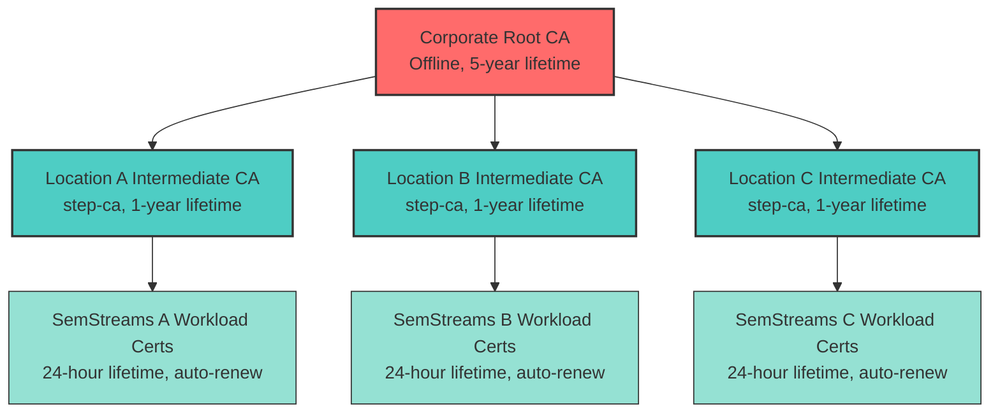
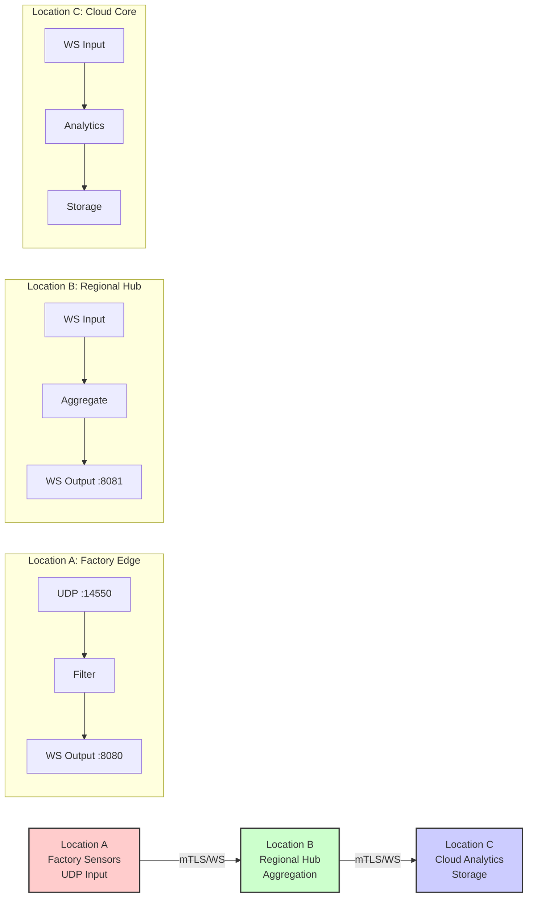

# Federation: Multi-Location Deployment

Comprehensive guide to deploying SemStreams across multiple geographic locations with automated PKI, secure mTLS communication, and centralized trust management

---

## Overview

SemStreams federation enables secure, distributed deployments where multiple edge locations communicate with regional hubs or cloud data centers. Each location runs an independent SemStreams instance with automated certificate management via ACME and step-ca.

**Key Benefits**:

- **Zero-Trust Security**: Every connection authenticated with mTLS certificates
- **Automated PKI**: 24-hour certificate lifecycle with automatic renewal
- **Hierarchical Trust**: Corporate root CA delegates to location-specific intermediates
- **Operational Simplicity**: Set-and-forget certificate management at scale
- **Graceful Degradation**: Fallback to manual certificates if ACME unavailable

**Use Cases**:

- **Edge-to-Cloud**: IoT sensors → Regional hub → Analytics cloud
- **Multi-Region**: Geographic distribution with shared trust model
- **Hierarchical Processing**: Pre-process at edge, aggregate regionally, analyze centrally
- **Distributed Robotics**: Fleet management across multiple facilities

---

## Architecture

### Trust Model

SemStreams federation uses a **hierarchical PKI architecture** with three layers:



**Trust Layers**:

1. **Root CA** (offline): Long-lived corporate root, signs intermediate CAs
2. **Intermediate CAs** (step-ca): Per-location certificate authorities running ACME
3. **Workload Certificates**: Short-lived (24h) certificates for SemStreams instances

**Why This Works**:

- All locations trust the same root CA certificate (distributed once during setup)
- Each location's step-ca issues workload certificates signed by location intermediate
- Workload certificates from any location are trusted by all others (chain to shared root)
- Short certificate lifetimes eliminate need for revocation infrastructure

### Certificate Hierarchy

```
federation-root-ca.crt (distributed to ALL locations)
    ├── location-a-intermediate-ca.crt
    │   └── semstreams-a.local (24h, auto-renew every 16h)
    ├── location-b-intermediate-ca.crt
    │   └── semstreams-b.local (24h, auto-renew every 16h)
    └── location-c-intermediate-ca.crt
        └── semstreams-c.local (24h, auto-renew every 16h)
```

**Certificate Distribution**:

- **Root CA cert**: Distributed to all locations (public, read-only)
- **Intermediate CA cert/key**: One per location, generated by step-ca during initialization
- **Workload certs**: Automatically obtained via ACME, renewed every 16 hours

---

## Prerequisites

Before setting up federation:

1. **Infrastructure**:
   - DNS resolution between locations (or /etc/hosts entries)
   - Network connectivity on required ports (9000 for step-ca, 8080+ for SemStreams)
   - Docker or Kubernetes for container orchestration

2. **Security**:
   - Secure offline machine for root CA generation (air-gapped recommended)
   - Secure storage for root CA private key (encrypt at rest)
   - Access control for step-ca admin passwords

3. **Planning**:
   - Define location names (e.g., `factory-a`, `warehouse-b`, `cloud-analytics`)
   - Allocate DNS names or IP addresses for each SemStreams instance
   - Plan network topology (which locations connect to which)

---

## Setup Guide

### Step 1: Generate Root CA (Offline)

Perform this on a **secure, offline machine** (air-gapped recommended):

```bash
# Install step CLI
wget https://dl.step.sm/gh-release/cli/gh-release-header/v0.25.0/step_linux_0.25.0_amd64.tar.gz
tar -xzf step_linux_0.25.0_amd64.tar.gz
sudo mv step_0.25.0/bin/step /usr/local/bin/

# Generate root CA
step certificate create "SemStreams Federation Root CA" \
  federation-root-ca.crt \
  federation-root-ca-key.pem \
  --profile root-ca \
  --kty RSA \
  --size 4096 \
  --not-after 43800h \
  --no-password \
  --insecure

# Verify root CA
step certificate inspect federation-root-ca.crt

# Expected output:
# Subject: SemStreams Federation Root CA
# Validity: 5 years
# Key Usage: Certificate Sign, CRL Sign
```

**Security Best Practices**:

- Keep `federation-root-ca-key.pem` on encrypted USB drive, store in secure facility
- **Never** connect this key to network-attached machines
- Use hardware security module (HSM) for production environments
- Document root CA fingerprint for verification: `step certificate fingerprint federation-root-ca.crt`

**Distribution**:

- Copy `federation-root-ca.crt` (public certificate) to all locations via secure channel
- **Never** distribute `federation-root-ca-key.pem` except for generating intermediates

### Step 2: Configure step-ca at Each Location

Each location runs its own step-ca instance with an intermediate CA signed by the root.

#### Location A: Factory Edge

**Generate Intermediate CA** (on secure machine with root CA key):

```bash
# Generate intermediate CA for Location A
step certificate create "Location A Intermediate CA" \
  location-a-intermediate-ca.crt \
  location-a-intermediate-ca-key.pem \
  --profile intermediate-ca \
  --ca federation-root-ca.crt \
  --ca-key federation-root-ca-key.pem \
  --kty RSA \
  --size 2048 \
  --not-after 8760h \
  --no-password \
  --insecure

# Verify intermediate
step certificate inspect location-a-intermediate-ca.crt --short
# Expected: CN=Location A Intermediate CA, Issuer=SemStreams Federation Root CA
```

**Deploy step-ca** (on Location A server):

```bash
# Create step-ca configuration directory
mkdir -p /etc/step-ca/location-a

# Copy certificates to location
scp federation-root-ca.crt admin@location-a:/etc/step-ca/location-a/
scp location-a-intermediate-ca.crt admin@location-a:/etc/step-ca/location-a/
scp location-a-intermediate-ca-key.pem admin@location-a:/etc/step-ca/location-a/

# On Location A server, initialize step-ca
docker run -d \
  --name step-ca-location-a \
  --network semstreams-federation \
  -p 9000:9000 \
  -v /etc/step-ca/location-a:/home/step \
  -e DOCKER_STEPCA_INIT_NAME="Location A CA" \
  -e DOCKER_STEPCA_INIT_DNS_NAMES="step-ca-a.local,localhost" \
  -e DOCKER_STEPCA_INIT_PROVISIONER_NAME="acme" \
  -e DOCKER_STEPCA_INIT_DEFAULT_CERT_VALIDITY="24h" \
  smallstep/step-ca:latest

# Wait for initialization
docker logs -f step-ca-location-a
# Look for: "Serving HTTPS on :9000"
```

**Configure ACME Provisioner**:

```bash
# Access step-ca container
docker exec -it step-ca-location-a /bin/sh

# Add ACME provisioner (if not created during init)
step ca provisioner add acme --type ACME

# Verify ACME directory is accessible
curl -k https://localhost:9000/acme/acme/directory
# Expected: JSON with ACME endpoints (newNonce, newAccount, etc.)

# Exit container
exit
```

**Repeat for Location B and Location C** with appropriate names and DNS entries.

### Step 3: Configure SemStreams Instances

Each SemStreams instance needs:

1. Root CA certificate for trust validation
2. ACME configuration pointing to local step-ca
3. mTLS configuration for client authentication
4. CN whitelist for authorized peers

#### Location A Configuration (WebSocket Output)

**File**: `/etc/semstreams/location-a-config.json`

```json
{
  "components": [
    {
      "id": "sensor-data-output",
      "type": "websocket_output",
      "config": {
        "port": 8080,
        "path": "/edge-data"
      }
    }
  ],
  "security": {
    "tls": {
      "server": {
        "enabled": true,
        "mode": "acme",
        "min_version": "1.2",

        "acme": {
          "enabled": true,
          "directory_url": "https://step-ca-a.local:9000/acme/acme/directory",
          "email": "admin@location-a.example.com",
          "domains": ["semstreams-a.local"],
          "challenge_type": "http-01",
          "renew_before": "8h",
          "storage_path": "/data/acme-certs",
          "ca_bundle": "/certs/federation-root-ca.crt"
        },

        "mtls": {
          "enabled": true,
          "client_ca_files": ["/certs/federation-root-ca.crt"],
          "require_client_cert": true,
          "allowed_client_cns": [
            "semstreams-b.local",
            "semstreams-c.local"
          ]
        }
      }
    }
  }
}
```

**Key Points**:

- `mode: "acme"` enables automated certificate management
- `directory_url` points to local step-ca ACME endpoint
- `domains` matches SemStreams DNS name (must be resolvable)
- `ca_bundle` validates step-ca's certificate (signed by root)
- `client_ca_files` trusts root CA for client certificate validation
- `allowed_client_cns` whitelists only Location B and C

#### Location B Configuration (WebSocket Input + Output)

**File**: `/etc/semstreams/location-b-config.json`

```json
{
  "components": [
    {
      "id": "receive-from-location-a",
      "type": "websocket_input",
      "config": {
        "url": "wss://semstreams-a.local:8080/edge-data"
      }
    },
    {
      "id": "aggregate-output",
      "type": "websocket_output",
      "config": {
        "port": 8081,
        "path": "/regional-aggregate"
      }
    }
  ],
  "security": {
    "tls": {
      "server": {
        "enabled": true,
        "mode": "acme",
        "min_version": "1.2",

        "acme": {
          "enabled": true,
          "directory_url": "https://step-ca-b.local:9000/acme/acme/directory",
          "email": "admin@location-b.example.com",
          "domains": ["semstreams-b.local"],
          "challenge_type": "http-01",
          "renew_before": "8h",
          "storage_path": "/data/acme-certs",
          "ca_bundle": "/certs/federation-root-ca.crt"
        },

        "mtls": {
          "enabled": true,
          "client_ca_files": ["/certs/federation-root-ca.crt"],
          "require_client_cert": true,
          "allowed_client_cns": ["semstreams-c.local"]
        }
      },

      "client": {
        "mode": "acme",
        "ca_files": ["/certs/federation-root-ca.crt"],
        "min_version": "1.2",

        "acme": {
          "enabled": true,
          "directory_url": "https://step-ca-b.local:9000/acme/acme/directory",
          "email": "admin@location-b.example.com",
          "domains": ["semstreams-b.local"],
          "challenge_type": "http-01",
          "renew_before": "8h",
          "storage_path": "/data/acme-certs-client"
        }
      }
    }
  }
}
```

**Key Points**:

- Location B acts as both client (to A) and server (to C)
- Server and client ACME configs can share certificates (same domain)
- Client `ca_files` includes root CA to validate Location A's certificate
- Server `allowed_client_cns` only allows Location C to connect

#### Location C Configuration (WebSocket Input)

**File**: `/etc/semstreams/location-c-config.json`

```json
{
  "components": [
    {
      "id": "receive-aggregated-data",
      "type": "websocket_input",
      "config": {
        "url": "wss://semstreams-b.local:8081/regional-aggregate"
      }
    }
  ],
  "security": {
    "tls": {
      "client": {
        "mode": "acme",
        "ca_files": ["/certs/federation-root-ca.crt"],
        "min_version": "1.2",

        "acme": {
          "enabled": true,
          "directory_url": "https://step-ca-c.local:9000/acme/acme/directory",
          "email": "admin@location-c.example.com",
          "domains": ["semstreams-c.local"],
          "challenge_type": "http-01",
          "renew_before": "8h",
          "storage_path": "/data/acme-certs"
        }
      }
    }
  }
}
```

**Key Points**:

- Location C is client-only (no server configuration needed)
- ACME still needed to obtain client certificate for mTLS
- `ca_files` validates Location B's server certificate

### Step 4: Verify Federation

**Test Certificate Chain** (from any location):

```bash
# Verify Location A's certificate chains to root
openssl s_client -connect semstreams-a.local:8080 \
  -CAfile /certs/federation-root-ca.crt \
  -showcerts

# Look for:
# Verify return code: 0 (ok)
# depth=2 CN = SemStreams Federation Root CA
# depth=1 CN = Location A Intermediate CA
# depth=0 CN = semstreams-a.local
```

**Test mTLS Connection** (Location B connecting to A):

```bash
# From Location B, test connection to A with client certificate
docker exec semstreams-b curl -vvv \
  --cacert /certs/federation-root-ca.crt \
  --cert /data/acme-certs-client/certificate.pem \
  --key /data/acme-certs-client/certificate.key \
  https://semstreams-a.local:8080/edge-data

# Expected: HTTP 101 Switching Protocols (WebSocket upgrade)
```

**Monitor Certificate Renewal**:

```bash
# Watch SemStreams logs for automatic renewal
docker logs -f semstreams-a | grep -i "certificate\|renew\|acme"

# Expected (every 16 hours):
# INFO Certificate renewal check starting
# INFO Certificate renewed successfully domain=semstreams-a.local expiry=2025-11-16T10:00:00Z
# INFO Hot-reloaded certificate without downtime
```

**Verify End-to-End Data Flow**:

```bash
# Send test data to Location A
echo '{"test": "federation"}' | nc -u localhost 14550

# Check Location C receives the data
docker exec semstreams-c tail -f /data/output.jsonl
# Expected: {"test": "federation", ...}
```

---

## Example: Three-Location Deployment

### Topology



### Docker Compose Deployment

**File**: `docker-compose.federation.yml`

```yaml
version: '3.8'

networks:
  semstreams-federation:
    driver: bridge

volumes:
  step-ca-a-data:
  step-ca-b-data:
  step-ca-c-data:
  acme-certs-a:
  acme-certs-b:
  acme-certs-c:

services:
  # Step-CA instances
  step-ca-a:
    image: smallstep/step-ca:latest
    container_name: step-ca-a
    hostname: step-ca-a.local
    networks:
      - semstreams-federation
    ports:
      - "9000:9000"
    volumes:
      - step-ca-a-data:/home/step
      - ./certs/federation-root-ca.crt:/home/step/certs/root_ca.crt:ro
    environment:
      - DOCKER_STEPCA_INIT_NAME=Location A CA
      - DOCKER_STEPCA_INIT_DNS_NAMES=step-ca-a.local,localhost
      - DOCKER_STEPCA_INIT_PROVISIONER_NAME=acme
    restart: unless-stopped

  step-ca-b:
    image: smallstep/step-ca:latest
    container_name: step-ca-b
    hostname: step-ca-b.local
    networks:
      - semstreams-federation
    ports:
      - "9001:9000"
    volumes:
      - step-ca-b-data:/home/step
      - ./certs/federation-root-ca.crt:/home/step/certs/root_ca.crt:ro
    environment:
      - DOCKER_STEPCA_INIT_NAME=Location B CA
      - DOCKER_STEPCA_INIT_DNS_NAMES=step-ca-b.local,localhost
      - DOCKER_STEPCA_INIT_PROVISIONER_NAME=acme
    restart: unless-stopped

  step-ca-c:
    image: smallstep/step-ca:latest
    container_name: step-ca-c
    hostname: step-ca-c.local
    networks:
      - semstreams-federation
    ports:
      - "9002:9000"
    volumes:
      - step-ca-c-data:/home/step
      - ./certs/federation-root-ca.crt:/home/step/certs/root_ca.crt:ro
    environment:
      - DOCKER_STEPCA_INIT_NAME=Location C CA
      - DOCKER_STEPCA_INIT_DNS_NAMES=step-ca-c.local,localhost
      - DOCKER_STEPCA_INIT_PROVISIONER_NAME=acme
    restart: unless-stopped

  # SemStreams instances
  semstreams-a:
    image: semstreams:latest
    container_name: semstreams-a
    hostname: semstreams-a.local
    networks:
      - semstreams-federation
    ports:
      - "14550:14550/udp"  # UDP input
      - "8080:8080"         # WebSocket output
    volumes:
      - ./configs/location-a-config.json:/etc/semstreams/config.json:ro
      - ./certs/federation-root-ca.crt:/certs/federation-root-ca.crt:ro
      - acme-certs-a:/data/acme-certs
    depends_on:
      - step-ca-a
    restart: unless-stopped

  semstreams-b:
    image: semstreams:latest
    container_name: semstreams-b
    hostname: semstreams-b.local
    networks:
      - semstreams-federation
    ports:
      - "8081:8081"  # WebSocket output
    volumes:
      - ./configs/location-b-config.json:/etc/semstreams/config.json:ro
      - ./certs/federation-root-ca.crt:/certs/federation-root-ca.crt:ro
      - acme-certs-b:/data/acme-certs
    depends_on:
      - step-ca-b
      - semstreams-a
    restart: unless-stopped

  semstreams-c:
    image: semstreams:latest
    container_name: semstreams-c
    hostname: semstreams-c.local
    networks:
      - semstreams-federation
    volumes:
      - ./configs/location-c-config.json:/etc/semstreams/config.json:ro
      - ./certs/federation-root-ca.crt:/certs/federation-root-ca.crt:ro
      - acme-certs-c:/data/acme-certs
      - ./data:/data/output
    depends_on:
      - step-ca-c
      - semstreams-b
    restart: unless-stopped
```

**Start the Federation**:

```bash
# Start all services
docker compose -f docker-compose.federation.yml up -d

# Verify all services healthy
docker compose -f docker-compose.federation.yml ps

# Watch certificate obtainment
docker compose -f docker-compose.federation.yml logs -f | grep -i certificate

# Test end-to-end
echo '{"sensor": "temperature", "value": 72.5}' | nc -u localhost 14550

# Verify data arrives at Location C
docker exec semstreams-c cat /data/output/data.jsonl
```

---

## Operational Procedures

### Adding a New Location

To add Location D to existing federation:

1. **Generate Intermediate CA** (offline, with root CA key):

   ```bash
   step certificate create "Location D Intermediate CA" \
     location-d-intermediate-ca.crt \
     location-d-intermediate-ca-key.pem \
     --profile intermediate-ca \
     --ca federation-root-ca.crt \
     --ca-key federation-root-ca-key.pem \
     --kty RSA --size 2048 \
     --not-after 8760h --no-password --insecure
   ```

2. **Deploy step-ca** at Location D (same process as Step 2 above)

3. **Update CN Whitelists**:
   - Add `semstreams-d.local` to `allowed_client_cns` on servers D will connect to
   - Restart affected SemStreams instances to reload configuration

4. **Configure Location D** (use Location C config as template)

5. **Verify**: Test connection from D to existing locations

### Certificate Rotation

**Workload Certificates** (automatic):

- Certificates auto-renew every 16 hours (8 hours before 24-hour expiry)
- Hot-reloaded without downtime
- Monitor logs for renewal failures: `docker logs semstreams-a | grep -i "renewal failed"`

**Intermediate CA Certificates** (annual):

1. **Generate new intermediate** (offline, 30 days before expiry):

   ```bash
   step certificate create "Location A Intermediate CA" \
     location-a-intermediate-ca-new.crt \
     location-a-intermediate-ca-new-key.pem \
     --profile intermediate-ca \
     --ca federation-root-ca.crt \
     --ca-key federation-root-ca-key.pem \
     --kty RSA --size 2048 \
     --not-after 8760h --no-password --insecure
   ```

2. **Update step-ca** (during maintenance window):

   ```bash
   # Stop step-ca
   docker stop step-ca-location-a

   # Replace intermediate certificates
   cp location-a-intermediate-ca-new.crt /etc/step-ca/location-a/certs/intermediate_ca.crt
   cp location-a-intermediate-ca-new-key.pem /etc/step-ca/location-a/secrets/intermediate_ca_key

   # Start step-ca
   docker start step-ca-location-a
   ```

3. **Verify**: Workload certificates issued after restart will use new intermediate

**Root CA Rotation** (5-year lifecycle):

- Plan root CA rotation 6 months before expiry
- Dual-root transition period: trust both old and new roots for 90 days
- Generate new root, sign new intermediates, distribute new root CA cert
- Remove old root CA after all workload certificates renewed

### Monitoring Federation Health

**Step-CA Health**:

```bash
# Check step-ca health
docker exec step-ca-location-a step ca health

# View certificate issuance logs
docker logs step-ca-location-a | grep -i "certificate issued"
```

**Certificate Expiry Tracking**:

```bash
# Check workload certificate expiry
openssl s_client -connect semstreams-a.local:8080 2>/dev/null | \
  openssl x509 -noout -dates

# Expected: notAfter within next 24 hours (constantly renewing)
```

**mTLS Connection Health**:

```bash
# Test mTLS handshake success rate
docker exec semstreams-b curl -I \
  --cacert /certs/federation-root-ca.crt \
  --cert /data/acme-certs-client/certificate.pem \
  --key /data/acme-certs-client/certificate.key \
  https://semstreams-a.local:8080/health

# Expected: HTTP 200 OK
```

**Prometheus Metrics** (if observability enabled):

```promql
# Certificate renewal success rate
rate(semstreams_acme_renewal_success_total[1h])

# Certificate expiry time
semstreams_certificate_expiry_seconds

# mTLS handshake failures
rate(semstreams_mtls_handshake_failures_total[5m])
```

---

## Troubleshooting

### Common Issues

#### Issue: "certificate signed by unknown authority"

**Symptom**: Location B cannot connect to Location A's WebSocket

**Diagnosis**:

```bash
# Test server certificate chain
openssl s_client -connect semstreams-a.local:8080 \
  -CAfile /certs/federation-root-ca.crt

# Look for verify error before depth:X
```

**Possible Causes**:

1. **Root CA not distributed**: `federation-root-ca.crt` missing at Location B
2. **Wrong CA file**: Client using different root CA than server's chain
3. **Intermediate CA not signed by root**: Intermediate was self-signed by mistake

**Resolution**:

```bash
# Verify root CA fingerprint matches across locations
step certificate fingerprint /certs/federation-root-ca.crt

# Re-verify intermediate CA signature
step certificate verify location-a-intermediate-ca.crt \
  --roots federation-root-ca.crt

# If mismatch, regenerate intermediate with correct root CA key
```

#### Issue: ACME certificate obtainment fails

**Symptom**: SemStreams logs show "failed to obtain certificate from ACME server"

**Diagnosis**:

```bash
# Test ACME directory accessibility
curl -k https://step-ca-a.local:9000/acme/acme/directory

# Check step-ca logs
docker logs step-ca-location-a | grep -i error
```

**Possible Causes**:

1. **step-ca not running**: Container stopped or unhealthy
2. **DNS resolution failure**: `semstreams-a.local` not resolvable from step-ca
3. **Challenge failure**: HTTP-01 challenge port 80 blocked
4. **CA bundle mismatch**: step-ca certificate not trusted by client

**Resolution**:

```bash
# Verify step-ca health
docker exec step-ca-location-a step ca health

# Test DNS resolution
docker exec semstreams-a nslookup step-ca-a.local

# Switch to TLS-ALPN-01 challenge if HTTP blocked
# In config.json:
"challenge_type": "tls-alpn-01"

# Verify CA bundle matches step-ca certificate
openssl s_client -connect step-ca-a.local:9000 \
  -CAfile /certs/federation-root-ca.crt
```

#### Issue: mTLS handshake fails with "bad certificate"

**Symptom**: Server rejects client certificate with TLS error

**Diagnosis**:

```bash
# Check client certificate CN
openssl x509 -in /data/acme-certs-client/certificate.pem -noout -subject

# Check server's allowed CNs
grep allowed_client_cns /etc/semstreams/config.json
```

**Possible Causes**:

1. **CN not whitelisted**: Client CN not in server's `allowed_client_cns` array
2. **Client cert expired**: Certificate not renewed (check ACME renewal logs)
3. **No client certificate**: Client not providing certificate during handshake

**Resolution**:

```bash
# Add client CN to server whitelist
# In server config.json:
"allowed_client_cns": [
  "semstreams-b.local",
  "semstreams-c.local",
  "semstreams-d.local"  # Add new client
]

# Restart server to reload configuration
docker restart semstreams-a

# Force client certificate renewal
docker exec semstreams-b rm -rf /data/acme-certs-client/*
docker restart semstreams-b
```

#### Issue: Certificate renewal loop (renews constantly)

**Symptom**: Logs show certificate renewed every minute instead of every 16 hours

**Diagnosis**:

```bash
# Check certificate validity period
openssl x509 -in /data/acme-certs/certificate.pem -noout -dates

# Check renewal configuration
grep renew_before /etc/semstreams/config.json
```

**Possible Causes**:

1. **renew_before too large**: Set to > 12h (more than half of 24h lifetime)
2. **System clock skew**: Server time incorrect, thinks cert always expiring
3. **step-ca issuing short-lived certs**: Certificate lifetime < 24h

**Resolution**:

```bash
# Set renew_before to 8 hours (1/3 of lifetime)
# In config.json:
"renew_before": "8h"

# Verify system time synchronized
docker exec semstreams-a date
timedatectl status  # On host

# Check step-ca certificate lifetime
docker exec step-ca-location-a step ca provisioner list
# Look for: "claims": {"defaultTLSCertDuration": "24h"}
```

### Debug Commands

**Verify Complete Certificate Chain**:

```bash
# Download entire chain from server
openssl s_client -connect semstreams-a.local:8080 -showcerts \
  < /dev/null 2>/dev/null > chain.pem

# Extract and verify each certificate
csplit -z -f cert- chain.pem '/-----BEGIN CERTIFICATE-----/' '{*}'
openssl x509 -in cert-00 -noout -subject -issuer  # Leaf
openssl x509 -in cert-01 -noout -subject -issuer  # Intermediate
openssl x509 -in cert-02 -noout -subject -issuer  # Root
```

**Test mTLS from Command Line**:

```bash
# Perform complete mTLS handshake
openssl s_client \
  -connect semstreams-a.local:8080 \
  -CAfile /certs/federation-root-ca.crt \
  -cert /data/acme-certs-client/certificate.pem \
  -key /data/acme-certs-client/certificate.key \
  -state -debug

# Look for:
# SSL_connect:SSLv3/TLS write client hello
# SSL_connect:SSLv3/TLS write client certificate
# SSL_connect:SSLv3/TLS write finished
# Verify return code: 0 (ok)
```

**Inspect ACME Storage**:

```bash
# View ACME client state
ls -la /data/acme-certs/
# Expected files:
# - account.json      (ACME account registration)
# - account.key       (ACME account private key)
# - certificate.pem   (Workload certificate)
# - certificate.key   (Workload private key)

# Check certificate subject matches domain
openssl x509 -in /data/acme-certs/certificate.pem -noout -subject
# Expected: CN=semstreams-a.local
```

### Fallback Procedures

If ACME is unavailable, SemStreams gracefully falls back to manual certificates:

**Option 1: Use Existing Manual Certificates**

```json
{
  "security": {
    "tls": {
      "server": {
        "enabled": true,
        "mode": "manual",
        "cert_file": "/certs/manual-server.crt",
        "key_file": "/certs/manual-server.key",
        "mtls": {
          "enabled": true,
          "client_ca_files": ["/certs/federation-root-ca.crt"],
          "require_client_cert": true,
          "allowed_client_cns": ["semstreams-b.local"]
        }
      }
    }
  }
}
```

**Option 2: Disable TLS Temporarily** (trusted networks only):

```json
{
  "security": {
    "tls": {
      "server": {
        "enabled": false
      }
    }
  }
}
```

**Recovery Checklist**:

1. Identify root cause (step-ca down, network issue, misconfiguration)
2. Activate fallback mode (manual certs or disable TLS)
3. Restore service operation
4. Fix root cause (restart step-ca, fix DNS, update config)
5. Re-enable ACME mode
6. Verify automatic renewal working

---

## Security Best Practices

### Certificate Management

1. **Root CA Security**:
   - Generate on air-gapped machine, never connect to network
   - Encrypt private key at rest with strong passphrase
   - Store in secure facility (safe, HSM, vault)
   - Document fingerprint and distribution method
   - Plan rotation schedule (5-year lifecycle)

2. **Intermediate CA Security**:
   - Use separate intermediate per location (blast radius containment)
   - Store intermediate keys in step-ca encrypted volumes
   - Monitor step-ca access logs for unauthorized admin commands
   - Set 1-year lifetime for intermediates (easier rotation than root)

3. **Workload Certificate Hygiene**:
   - Short lifetimes (24h) eliminate need for CRL/OCSP infrastructure
   - Monitor renewal success rate (should be > 99.9%)
   - Alert on renewal failures before expiry
   - Rotate ACME account keys annually

### Network Security

1. **Firewall Rules**:
   - Restrict step-ca port 9000 to local network or VPN
   - Only allow WebSocket ports (8080+) from authorized locations
   - Block ACME challenge ports (80/443) from internet if using internal CA

2. **TLS Configuration**:
   - Enforce minimum TLS 1.2 (prefer TLS 1.3)
   - Disable weak cipher suites
   - Use strong key types (RSA 2048+ or ECDSA P-256+)

3. **mTLS Best Practices**:
   - Always use `require_client_cert: true` in production
   - Maintain strict `allowed_client_cns` whitelists
   - Review and update CN whitelists quarterly
   - Use specific CNs, never wildcards

### Operational Security

1. **Access Control**:
   - Separate admin credentials for each location's step-ca
   - Use role-based access control (RBAC) for configuration changes
   - Audit all certificate issuance and revocation events
   - Rotate admin passwords quarterly

2. **Monitoring and Alerting**:
   - Alert on certificate expiry < 8 hours (renewal should have happened)
   - Alert on ACME renewal failures
   - Alert on mTLS handshake failures (unauthorized access attempts)
   - Alert on step-ca downtime
   - Monitor certificate issuance rate anomalies

3. **Incident Response**:
   - Document certificate revocation procedure
   - Maintain runbook for step-ca recovery
   - Test fallback to manual certificates in staging
   - Keep offline backup of root CA and intermediates

4. **Defense in Depth**:
   - TLS/mTLS provides transport security, not application security
   - Implement application-level authentication (API keys, OAuth)
   - Use network segmentation (VLANs, VPNs) in addition to mTLS
   - Enable audit logging at SemStreams application layer

---

## See Also

- **ACME Setup Guide**: [acme-setup.md](acme-setup.md) - Detailed step-ca configuration
- **TLS Configuration**: [tls-setup.md](tls-setup.md) - Complete TLS reference
- **Optional Services**: [optional-services.md](optional-services.md) - step-ca deployment
- **Production Deployment**: [production.md](production.md) - Multi-location operations
- **Configuration Guide**: [configuration.md](configuration.md) - SemStreams configuration
- **Monitoring Guide**: [monitoring.md](monitoring.md) - Production monitoring

---

**Key Takeaway**: SemStreams federation provides zero-trust, automated PKI for multi-location deployments. With proper setup and monitoring, certificate management becomes transparent and secure at scale.
