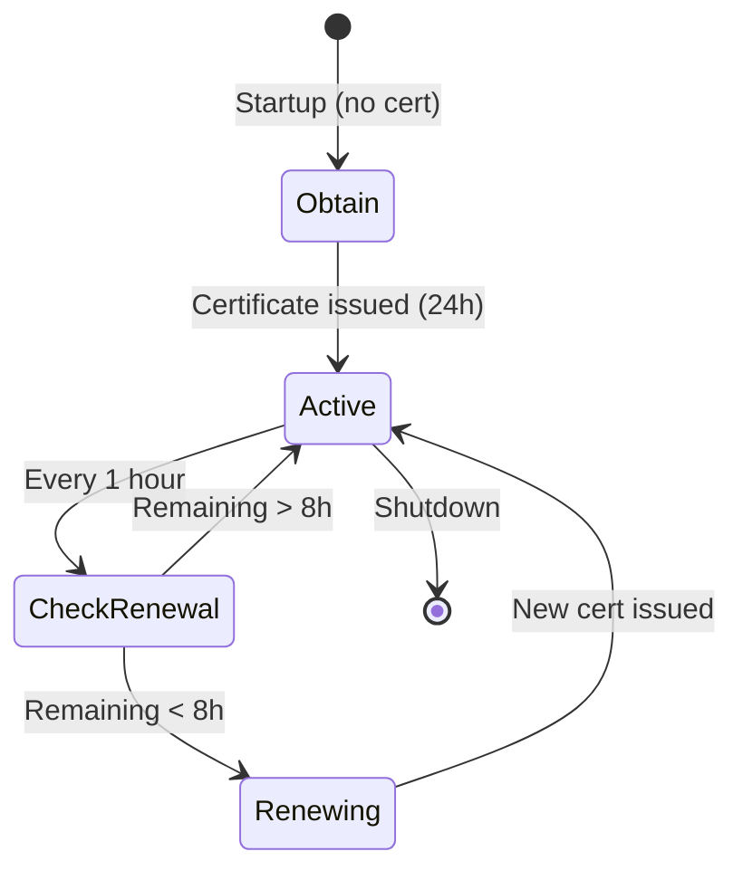

# TLS and mTLS Setup Guide

Complete guide to configuring Transport Layer Security (TLS) and mutual TLS (mTLS) for SemStreams deployments.

## Overview

SemStreams implements a **three-tier security model** that balances simplicity with enterprise PKI needs:

| Tier | Use Case | Complexity | Certificate Lifecycle |
|------|----------|------------|----------------------|
| **Tier 1: None** | Dev/testing, trusted networks | Zero config | N/A |
| **Tier 2: Manual TLS + mTLS** | 1-2 locations, existing PKI | Medium | Manual renewal (90 days) |
| **Tier 3: ACME + step-ca** | 3+ locations, enterprise | High setup, low maintenance | Automated (24 hours) |

**Current Status**: All tiers implemented and production-ready.

## Tier 1: No TLS (Default)

**Use Case**: Development, local testing, trusted internal networks

**Configuration**: No security configuration required.

```json
{
  "security": {}
}
```

**Security**: Plaintext communication. Acceptable for:
- Local development environments
- Trusted internal networks (air-gapped, VPN)
- Testing and CI/CD pipelines

**Not Recommended For**: Production deployments across untrusted networks.

---

## Tier 2: Manual TLS

**Use Case**: Small deployments (1-2 locations), existing PKI infrastructure

### Basic TLS (Server-Only Authentication)

Encrypts traffic and validates server identity, but does not authenticate clients.

#### Step 1: Generate Certificates

Using OpenSSL:

```bash
# Generate CA private key and certificate
openssl req -x509 -newkey rsa:4096 -keyout ca-key.pem -out ca-cert.pem -days 365 -nodes \
  -subj "/CN=SemStreams CA"

# Generate server private key and CSR
openssl req -newkey rsa:4096 -keyout server-key.pem -out server-csr.pem -nodes \
  -subj "/CN=semstreams-server.local"

# Sign server certificate with CA
openssl x509 -req -in server-csr.pem -CA ca-cert.pem -CAkey ca-key.pem \
  -CAcreateserial -out server-cert.pem -days 90
```

#### Step 2: Configure Server TLS (WebSocket Output)

```json
{
  "components": [
    {
      "id": "websocket-server",
      "type": "websocket_output",
      "config": {
        "port": 9000,
        "path": "/ws"
      }
    }
  ],
  "security": {
    "tls": {
      "server": {
        "enabled": true,
        "cert_file": "/certs/server-cert.pem",
        "key_file": "/certs/server-key.pem",
        "min_version": "1.2"
      }
    }
  }
}
```

**What This Does**:
- WebSocket output listens on `wss://0.0.0.0:9000/ws` (TLS-encrypted)
- Clients validate server certificate against CA
- No client authentication (any client can connect)

#### Step 3: Configure Client TLS (WebSocket Input)

```json
{
  "components": [
    {
      "id": "websocket-client",
      "type": "websocket_input",
      "config": {
        "url": "wss://semstreams-server.local:9000/ws"
      }
    }
  ],
  "security": {
    "tls": {
      "client": {
        "ca_files": ["/certs/ca-cert.pem"],
        "min_version": "1.2"
      }
    }
  }
}
```

**What This Does**:
- WebSocket input connects to server via TLS
- Validates server certificate using CA certificate
- Encrypted communication established

#### Step 4: Test TLS Connection

```bash
# Test server certificate
openssl s_client -connect semstreams-server.local:9000 -CAfile /certs/ca-cert.pem

# Expected output:
# Verify return code: 0 (ok)
```

---

## Tier 2: Mutual TLS (mTLS)

**Use Case**: Zero-trust security for federated edge deployments

### What is mTLS?

**Traditional TLS**: Client verifies server identity (one-way authentication)
**Mutual TLS**: Both client and server verify each other's identity (two-way authentication)

**Benefits**:
- Only authorized clients can connect (certificate-based access control)
- Common Name (CN) whitelisting for fine-grained access control
- Zero-trust security model for multi-location federation

### mTLS Setup

#### Step 1: Generate Client Certificates

```bash
# Generate client private key and CSR (for Location B)
openssl req -newkey rsa:4096 -keyout client-b-key.pem -out client-b-csr.pem -nodes \
  -subj "/CN=location-b.semstreams.local"

# Sign client certificate with CA
openssl x509 -req -in client-b-csr.pem -CA ca-cert.pem -CAkey ca-key.pem \
  -CAcreateserial -out client-b-cert.pem -days 90

# Generate client certificate for Location C
openssl req -newkey rsa:4096 -keyout client-c-key.pem -out client-c-csr.pem -nodes \
  -subj "/CN=location-c.semstreams.local"

openssl x509 -req -in client-c-csr.pem -CA ca-cert.pem -CAkey ca-key.pem \
  -CAcreateserial -out client-c-cert.pem -days 90
```

#### Step 2: Configure Server with mTLS (Location A)

```json
{
  "components": [
    {
      "id": "websocket-server",
      "type": "websocket_output",
      "config": {
        "port": 9000,
        "path": "/ws"
      }
    }
  ],
  "security": {
    "tls": {
      "server": {
        "enabled": true,
        "cert_file": "/certs/server-cert.pem",
        "key_file": "/certs/server-key.pem",
        "min_version": "1.2",

        "mtls": {
          "enabled": true,
          "client_ca_files": ["/certs/ca-cert.pem"],
          "require_client_cert": true,
          "allowed_client_cns": [
            "location-b.semstreams.local",
            "location-c.semstreams.local"
          ]
        }
      }
    }
  }
}
```

**What This Does**:
- Server requires client certificates (`require_client_cert: true`)
- Validates client certificates against CA (`client_ca_files`)
- Only allows clients with CN in whitelist (`allowed_client_cns`)
- Rejects unauthorized clients

#### Step 3: Configure Client with mTLS (Location B)

```json
{
  "components": [
    {
      "id": "websocket-client",
      "type": "websocket_input",
      "config": {
        "url": "wss://location-a.semstreams.local:9000/ws"
      }
    }
  ],
  "security": {
    "tls": {
      "client": {
        "ca_files": ["/certs/ca-cert.pem"],
        "min_version": "1.2",

        "mtls": {
          "enabled": true,
          "cert_file": "/certs/client-b-cert.pem",
          "key_file": "/certs/client-b-key.pem"
        }
      }
    }
  }
}
```

**What This Does**:
- Client provides certificate during TLS handshake
- Server validates client certificate and checks CN whitelist
- Mutual authentication established

#### Step 4: Test mTLS Connection

```bash
# Test mTLS handshake (should succeed)
curl -vvv --cacert /certs/ca-cert.pem \
  --cert /certs/client-b-cert.pem \
  --key /certs/client-b-key.pem \
  https://location-a.semstreams.local:9000/ws

# Test without client cert (should fail)
curl -vvv --cacert /certs/ca-cert.pem \
  https://location-a.semstreams.local:9000/ws
# Expected: SSL handshake failure (client cert required)

# Test with unauthorized CN (should fail)
curl -vvv --cacert /certs/ca-cert.pem \
  --cert /certs/unauthorized-cert.pem \
  --key /certs/unauthorized-key.pem \
  https://location-a.semstreams.local:9000/ws
# Expected: SSL handshake failure (CN not in whitelist)
```

---

## Federation Example: Three Edge Locations

### Architecture

```
┌──────────────────────┐       ┌──────────────────────┐       ┌──────────────────────┐
│    Location A        │       │    Location B        │       │    Location C        │
│  (Sensor Gateway)    │       │  (Processing Hub)    │       │  (Data Sink)         │
│                      │       │                      │       │                      │
│  WebSocket Output    │──────►│  WebSocket Input     │──────►│  WebSocket Input     │
│  Port: 9000          │ mTLS  │  WebSocket Output    │ mTLS  │                      │
│  Server mTLS         │       │  Client + Server     │       │  Client mTLS         │
│                      │       │  Port: 9001          │       │                      │
└──────────────────────┘       └──────────────────────┘       └──────────────────────┘
```

### Location A Configuration (WebSocket Output)

**File**: `location-a-config.json`

```json
{
  "components": [
    {
      "id": "sensor-output",
      "type": "websocket_output",
      "config": {
        "port": 9000,
        "path": "/ws"
      }
    }
  ],
  "security": {
    "tls": {
      "server": {
        "enabled": true,
        "cert_file": "/certs/location-a-cert.pem",
        "key_file": "/certs/location-a-key.pem",
        "mtls": {
          "enabled": true,
          "client_ca_files": ["/certs/federation-ca.pem"],
          "require_client_cert": true,
          "allowed_client_cns": ["location-b.semstreams.local"]
        }
      }
    }
  }
}
```

### Location B Configuration (WebSocket Input + Output)

**File**: `location-b-config.json`

```json
{
  "components": [
    {
      "id": "receive-from-a",
      "type": "websocket_input",
      "config": {
        "url": "wss://location-a.semstreams.local:9000/ws"
      }
    },
    {
      "id": "send-to-c",
      "type": "websocket_output",
      "config": {
        "port": 9001,
        "path": "/ws"
      }
    }
  ],
  "security": {
    "tls": {
      "server": {
        "enabled": true,
        "cert_file": "/certs/location-b-cert.pem",
        "key_file": "/certs/location-b-key.pem",
        "mtls": {
          "enabled": true,
          "client_ca_files": ["/certs/federation-ca.pem"],
          "require_client_cert": true,
          "allowed_client_cns": ["location-c.semstreams.local"]
        }
      },
      "client": {
        "ca_files": ["/certs/federation-ca.pem"],
        "mtls": {
          "enabled": true,
          "cert_file": "/certs/location-b-cert.pem",
          "key_file": "/certs/location-b-key.pem"
        }
      }
    }
  }
}
```

### Location C Configuration (WebSocket Input)

**File**: `location-c-config.json`

```json
{
  "components": [
    {
      "id": "receive-from-b",
      "type": "websocket_input",
      "config": {
        "url": "wss://location-b.semstreams.local:9001/ws"
      }
    }
  ],
  "security": {
    "tls": {
      "client": {
        "ca_files": ["/certs/federation-ca.pem"],
        "mtls": {
          "enabled": true,
          "cert_file": "/certs/location-c-cert.pem",
          "key_file": "/certs/location-c-key.pem"
        }
      }
    }
  }
}
```

### Certificate Distribution

**Shared Federation CA** (distributed to all locations):
- `federation-ca.pem` - Root CA certificate (public)
- `federation-ca-key.pem` - Root CA private key (keep secure, offline)

**Location A Certificates**:
- `location-a-cert.pem` - Server certificate (CN: location-a.semstreams.local)
- `location-a-key.pem` - Server private key

**Location B Certificates**:
- `location-b-cert.pem` - Server + client certificate (CN: location-b.semstreams.local)
- `location-b-key.pem` - Server + client private key

**Location C Certificates**:
- `location-c-cert.pem` - Client certificate (CN: location-c.semstreams.local)
- `location-c-key.pem` - Client private key

---

## Configuration Reference

### Server TLS Configuration

```json
{
  "security": {
    "tls": {
      "server": {
        "enabled": true,              // Enable TLS
        "cert_file": "/path/to/cert.pem",  // Server certificate
        "key_file": "/path/to/key.pem",    // Server private key
        "min_version": "1.2",         // Minimum TLS version ("1.2" or "1.3")

        "mtls": {
          "enabled": true,            // Enable mTLS (optional)
          "client_ca_files": [        // CA certificates to trust for clients
            "/path/to/client-ca.pem"
          ],
          "require_client_cert": true,     // true = required, false = optional
          "allowed_client_cns": [          // Optional CN whitelist
            "authorized-client-1",
            "authorized-client-2"
          ]
        }
      }
    }
  }
}
```

### Client TLS Configuration

```json
{
  "security": {
    "tls": {
      "client": {
        "ca_files": [                    // CA certificates to trust for servers
          "/path/to/server-ca.pem"
        ],
        "insecure_skip_verify": false,   // DEV/TEST ONLY - skip cert validation
        "min_version": "1.2",            // Minimum TLS version

        "mtls": {
          "enabled": true,               // Enable mTLS (optional)
          "cert_file": "/path/to/client-cert.pem",  // Client certificate
          "key_file": "/path/to/client-key.pem"     // Client private key
        }
      }
    }
  }
}
```

### Configuration Fields

#### Server TLS Fields

| Field | Type | Required | Default | Description |
|-------|------|----------|---------|-------------|
| `enabled` | boolean | No | `false` | Enable TLS for server components |
| `cert_file` | string | Yes* | - | Path to server certificate (PEM format) |
| `key_file` | string | Yes* | - | Path to server private key (PEM format) |
| `min_version` | string | No | `"1.2"` | Minimum TLS version (`"1.2"` or `"1.3"`) |

*Required when `enabled: true`

#### Server mTLS Fields

| Field | Type | Required | Default | Description |
|-------|------|----------|---------|-------------|
| `enabled` | boolean | No | `false` | Enable mTLS (client certificate validation) |
| `client_ca_files` | string[] | Yes* | - | CA certificates to trust for client validation |
| `require_client_cert` | boolean | No | `false` | Require client certificate (true) or optional (false) |
| `allowed_client_cns` | string[] | No | `[]` | Whitelist of allowed client Common Names (empty = allow all) |

*Required when `mtls.enabled: true`

#### Client TLS Fields

| Field | Type | Required | Default | Description |
|-------|------|----------|---------|-------------|
| `ca_files` | string[] | No | System CA pool | Additional CA certificates to trust for servers |
| `insecure_skip_verify` | boolean | No | `false` | **DEV/TEST ONLY** - Skip certificate validation |
| `min_version` | string | No | `"1.2"` | Minimum TLS version (`"1.2"` or `"1.3"`) |

#### Client mTLS Fields

| Field | Type | Required | Default | Description |
|-------|------|----------|---------|-------------|
| `enabled` | boolean | No | `false` | Enable mTLS (provide client certificate) |
| `cert_file` | string | Yes* | - | Path to client certificate (PEM format) |
| `key_file` | string | Yes* | - | Path to client private key (PEM format) |

*Required when `mtls.enabled: true`

---

## Troubleshooting

### Common Issues

#### Issue: "certificate signed by unknown authority"

**Cause**: Server certificate not trusted by client

**Solution**:
1. Verify CA certificate is correct: `openssl x509 -in ca-cert.pem -noout -text`
2. Check client configuration includes CA: `"ca_files": ["/certs/ca-cert.pem"]`
3. Test server certificate: `openssl s_client -connect server:9000 -CAfile ca-cert.pem`

#### Issue: "tls: bad certificate" (client connecting to mTLS server)

**Cause**: Server requires client certificate but client didn't provide one

**Solution**:
1. Enable client mTLS: `"mtls": { "enabled": true, ... }`
2. Verify client certificate exists: `ls /certs/client-cert.pem`
3. Test client cert: `openssl x509 -in client-cert.pem -noout -subject`

#### Issue: "client certificate CN not in allowed list"

**Cause**: Client Common Name not in server's `allowed_client_cns` whitelist

**Solution**:
1. Check client certificate CN: `openssl x509 -in client-cert.pem -noout -subject`
2. Verify CN matches whitelist: `"allowed_client_cns": ["exact-cn-here"]`
3. CN matching is case-sensitive and exact

#### Issue: "certificate has expired or is not yet valid"

**Cause**: Certificate validity period expired or not yet started

**Solution**:
1. Check certificate validity: `openssl x509 -in cert.pem -noout -dates`
2. Regenerate certificate if expired
3. Set longer validity: `openssl x509 ... -days 365`

#### Issue: "no such file or directory" when loading certificates

**Cause**: Certificate file path incorrect or file doesn't exist

**Solution**:
1. Use absolute paths: `"/certs/cert.pem"` not `"./cert.pem"`
2. Verify file exists: `ls -la /certs/cert.pem`
3. Check file permissions: `chmod 644 cert.pem` (certs), `chmod 600 key.pem` (keys)

### Debug Commands

**Verify certificate chain**:
```bash
openssl verify -CAfile ca-cert.pem server-cert.pem
# Expected: server-cert.pem: OK
```

**Test TLS connection**:
```bash
openssl s_client -connect server:9000 -CAfile ca-cert.pem -showcerts
# Look for: Verify return code: 0 (ok)
```

**Test mTLS connection**:
```bash
openssl s_client -connect server:9000 \
  -CAfile ca-cert.pem \
  -cert client-cert.pem \
  -key client-key.pem
# Look for: Verify return code: 0 (ok)
```

**Check certificate details**:
```bash
# View certificate subject and issuer
openssl x509 -in cert.pem -noout -subject -issuer

# View certificate validity dates
openssl x509 -in cert.pem -noout -dates

# View full certificate details
openssl x509 -in cert.pem -noout -text
```

**Validate private key matches certificate**:
```bash
# Compare certificate modulus
openssl x509 -in cert.pem -noout -modulus | openssl md5

# Compare key modulus (should match)
openssl rsa -in key.pem -noout -modulus | openssl md5
```

---

## Security Best Practices

### Certificate Management

1. **Keep Private Keys Secure**:
   - Store private keys with `600` permissions (owner read/write only)
   - Never commit private keys to version control
   - Use separate keys for each location/service

2. **Use Strong Keys**:
   - Minimum 2048-bit RSA or 256-bit ECDSA
   - Prefer 4096-bit RSA for long-lived CA keys

3. **Short Certificate Lifetimes**:
   - Server certificates: 90 days
   - Client certificates: 90 days
   - CA certificates: 1-5 years (longer is acceptable for root CAs)

4. **Certificate Rotation**:
   - Set calendar reminders for renewal (30 days before expiry)
   - Test renewal process in staging before production
   - Keep old certificates for 7 days during rotation

5. **CA Key Protection**:
   - Keep CA private key offline (air-gapped machine)
   - Encrypt CA key at rest
   - Use CA key only for signing, then remove from network

### mTLS Recommendations

1. **Use CN Whitelists**:
   - Always specify `allowed_client_cns` in production
   - Use specific CNs, avoid wildcards
   - Review whitelist quarterly

2. **Require Client Certificates**:
   - Set `require_client_cert: true` for zero-trust environments
   - Use optional mode (`false`) only for gradual rollout

3. **Federate CA Trust**:
   - Use single root CA for all locations (simplifies trust)
   - Distribute root CA certificate to all locations
   - Consider intermediate CAs for large deployments (Tier 3)

### Operational Security

1. **Monitor Certificate Expiry**:
   - Set up alerts 30 days before expiry
   - Track all certificates in inventory
   - Automate renewal notifications

2. **Log TLS Handshakes**:
   - Enable TLS handshake logging in production
   - Monitor for unauthorized connection attempts
   - Alert on CN whitelist rejections

3. **Regular Audits**:
   - Review `allowed_client_cns` quarterly
   - Audit certificate usage (which certs are actually in use)
   - Revoke and replace compromised certificates immediately

4. **Defense in Depth**:
   - TLS/mTLS is transport security, not application security
   - Implement application-level authentication/authorization
   - Use network segmentation (firewalls, VPNs) in addition to TLS

---

## Tier 3: ACME with step-ca

**Status**: ✅ **Implemented** - Production-ready automated PKI

For deployments with **3+ locations**, Tier 3 provides automated certificate lifecycle management via ACME protocol and step-ca.

### What You Get

- **Automated 24-hour certificate renewal** (no manual intervention)
- **Certificate hot-reload** (zero-downtime updates)
- **Federation support** for multi-location trust
- **Graceful fallback** to manual certificates if ACME unavailable

### Quick Start

1. **Start step-ca**:

   ```bash
   task services:start:tls
   # or
   docker compose -f docker-compose.services.yml --profile tls up -d
   ```

2. **Configure SemStreams**:

   ```json
   {
     "security": {
       "tls": {
         "server": {
           "enabled": true,
           "mode": "acme",
           "min_version": "1.2",

           "acme": {
             "enabled": true,
             "directory_url": "https://step-ca:9000/acme/acme/directory",
             "email": "admin@example.com",
             "domains": ["semstreams.local"],
             "challenge_type": "http-01",
             "renew_before": "8h",
             "storage_path": "/data/acme-certs"
           }
         }
       }
     }
   }
   ```

3. **That's it!** Certificates auto-renew every 16 hours.

### Certificate Lifecycle



**Timeline**:

- **T+0h**: Certificate obtained (24-hour lifetime)
- **T+1h**: Background renewal check (no action, remaining 23h)
- **T+16h**: Renewal triggered (remaining 8h < threshold)
- **T+16h+10s**: New certificate issued, hot-reloaded
- **T+40h**: Next renewal (new cert now at 16h remaining)

### Configuration Reference

**Server ACME** (WebSocket outputs, HTTP servers):

```json
{
  "security": {
    "tls": {
      "server": {
        "enabled": true,
        "mode": "acme",
        "min_version": "1.2",

        "acme": {
          "enabled": true,
          "directory_url": "https://step-ca:9000/acme/acme/directory",
          "email": "admin@example.com",
          "domains": ["semstreams-server.local"],
          "challenge_type": "http-01",
          "renew_before": "8h",
          "storage_path": "/data/acme-certs",
          "ca_bundle": "/certs/step-ca-root.crt"
        },

        "mtls": {
          "enabled": true,
          "client_ca_files": ["/certs/federation-root-ca.crt"],
          "require_client_cert": true,
          "allowed_client_cns": ["authorized-client.local"]
        }
      }
    }
  }
}
```

**Client ACME** (WebSocket inputs with mTLS):

```json
{
  "security": {
    "tls": {
      "client": {
        "mode": "acme",
        "ca_files": ["/certs/step-ca-root.crt"],
        "min_version": "1.2",

        "acme": {
          "enabled": true,
          "directory_url": "https://step-ca:9000/acme/acme/directory",
          "email": "client@example.com",
          "domains": ["semstreams-client.local"],
          "challenge_type": "http-01",
          "renew_before": "8h",
          "storage_path": "/data/acme-certs-client"
        }
      }
    }
  }
}
```

### ACME Configuration Fields

| Field | Type | Required | Default | Description |
|-------|------|----------|---------|-------------|
| `enabled` | boolean | Yes | - | Enable ACME automation |
| `directory_url` | string | Yes | - | step-ca ACME directory endpoint |
| `email` | string | Yes | - | Contact email for ACME account |
| `domains` | string[] | Yes | - | Domain names for certificate (must be resolvable) |
| `challenge_type` | string | No | `"http-01"` | Challenge type (`"http-01"` or `"tls-alpn-01"`) |
| `renew_before` | string | No | `"8h"` | Renew when remaining lifetime < this duration |
| `storage_path` | string | Yes | - | Directory for ACME state (account, certificates) |
| `ca_bundle` | string | No | System CA | CA certificate to validate step-ca HTTPS |

### ACME Troubleshooting

**Issue**: Certificate obtainment fails

```bash
# Test step-ca reachable
curl -k https://step-ca:9000/acme/acme/directory

# Check DNS resolution
nslookup semstreams.local

# Verify port 80 (HTTP-01) or 443 (TLS-ALPN-01) accessible
netstat -tuln | grep -E ':(80|443)'
```

**Issue**: Renewal not happening

```bash
# Check renewal logs
docker logs semstreams | grep -i "renewal\|acme"

# Verify certificate expiry
openssl x509 -in /data/acme-certs/certificate.pem -noout -dates

# Force renewal by deleting certificate
rm /data/acme-certs/certificate.pem
docker restart semstreams
```

**Fallback to Manual**: If ACME unavailable, configure fallback certificates:

```json
{
  "security": {
    "tls": {
      "server": {
        "mode": "acme",
        "cert_file": "/certs/fallback-server.crt",
        "key_file": "/certs/fallback-server.key",
        "acme": {...}
      }
    }
  }
}
```

### See Also

- **ACME Setup Guide**: [ACME_SETUP.md](ACME_SETUP.md) - Complete step-ca deployment and configuration
- **Federation Guide**: [FEDERATION_GUIDE.md](FEDERATION_GUIDE.md) - Multi-location deployments with ACME
- **Optional Services**: [OPTIONAL_SERVICES.md](OPTIONAL_SERVICES.md) - step-ca service overview

---

## Related Documentation

- **ACME Setup Guide**: [ACME_SETUP.md](ACME_SETUP.md) - Complete step-ca deployment and configuration
- **Federation Guide**: [FEDERATION_GUIDE.md](FEDERATION_GUIDE.md) - Multi-location deployments with automated PKI
- **Optional Services**: [OPTIONAL_SERVICES.md](OPTIONAL_SERVICES.md) - step-ca and tiered security overview
- **Production Deployment**: [deployment/PRODUCTION.md](deployment/PRODUCTION.md) - Multi-location operations

## Support

For issues or questions:
- Review troubleshooting section above
- Check error logs for specific error messages
- Verify certificate validity with `openssl` commands
- Test TLS handshake with `openssl s_client`

**Issue Tracking**: Use `bd` (beads) for tracking mTLS-related issues.
