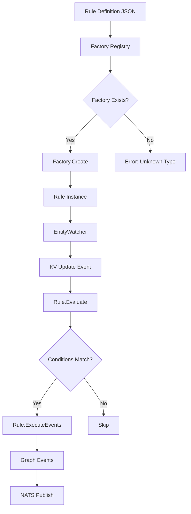

# SPEC-001: Generic Rules Engine for SemStreams

**Status**: Implemented

**Author**: Architecture Team

**Created**: 2024-01-15

**Updated**: 2025-11-19

**Target Release**: semstreams v0.2.0

**Implementation**: processor/rule package

## Executive Summary

The Rules Engine brings ingestion-time intelligence into semstreams core as a generic, domain-agnostic component
for dynamic knowledge graph enrichment. This component enables conditional logic, pattern detection, and automatic
graph evolution through a factory-based architecture.

**Problem**: Dynamic knowledge graphs need BOTH ingestion-time intelligence (rules) AND query-time intelligence
(PathRAG/GraphRAG). This spec defines the ingestion-time capabilities.

**Solution**: Factory pattern with typed Go implementations, JSON configuration, runtime reloading, and full
Component.Discoverable integration.

## Problem Statement

### Current Capabilities

**With Rules Engine:**

1. **Conditional logic** - Create alerts based on thresholds
2. **Pattern detection** - Detect anomalies in streaming data
3. **Derived relationships** - Link entities based on patterns
4. **Semantic enrichment** - Auto-tag and categorize entities
5. **Dynamic graph construction** - Rules define how graph evolves

**Example capabilities:**

- ✅ Create alert entity when battery < 20%
- ✅ Monitor threshold violations
- ✅ Detect patterns in entity updates
- ✅ Enrich entities with computed properties

### Strategic Importance

**Dynamic Knowledge Graphs require:**

```text
Ingestion Time           Query Time
─────────────────       ──────────────────
Rules Engine        →   PathRAG + GraphRAG
(build graph)           (query graph)
```

The Rules Engine provides the ingestion-time intelligence layer.

## Requirements

### Functional Requirements

#### FR-1: Rule Interface

**Interface definition:**

```go
type Rule interface {
    Name() string
    Subscribe() []string
    Evaluate(messages []message.Message) bool
    ExecuteEvents(messages []message.Message) ([]gtypes.Event, error)
}
```

**Methods:**

- `Name()` - Returns rule identifier for logging/metrics
- `Subscribe()` - Returns NATS subjects to watch
- `Evaluate()` - Evaluates conditions against messages
- `ExecuteEvents()` - Generates graph events on trigger

**Implementation status**: ✅ Implemented

#### FR-2: Factory Pattern

**Factory interface:**

```go
type RuleFactory interface {
    Create(id string, config RuleDefinition, deps RuleDependencies) (Rule, error)
    Type() string
    Schema() RuleSchema
    Validate(config RuleDefinition) error
}
```

**Registration:**

- Global factory registry
- `RegisterRuleFactory(type, factory)` for registration
- `GetRuleFactory(type)` for retrieval
- `CreateRuleFromDefinition()` for instantiation

**Implementation status**: ✅ Implemented

#### FR-3: JSON Configuration

**RuleDefinition structure:**

```go
type RuleDefinition struct {
    ID          string                   `json:"id"`
    Type        string                   `json:"type"`
    Name        string                   `json:"name"`
    Description string                   `json:"description"`
    Enabled     bool                     `json:"enabled"`
    Conditions  []ConditionExpression    `json:"conditions"`
    Logic       string                   `json:"logic"`
    Cooldown    string                   `json:"cooldown,omitempty"`
    Entity      EntityConfig             `json:"entity,omitempty"`
    Metadata    map[string]interface{}   `json:"metadata,omitempty"`
}

type EntityConfig struct {
    Pattern      string   `json:"pattern"`
    WatchBuckets []string `json:"watch_buckets"`
}
```

**Implementation status**: ✅ Implemented

#### FR-4: Condition Evaluation

**Operators supported:**

- Comparison: `eq`, `ne`, `lt`, `lte`, `gt`, `gte`
- String: `contains`, `starts_with`, `ends_with`, `regex`
- Logic: `and`, `or` between conditions

**Field access:**

- Dotted notation for nested properties (e.g., `"battery.level"`)
- Type coercion for comparisons

**Implementation status**: ✅ Implemented

#### FR-5: Event Generation

**Pattern**: Direct Go code generation (NOT template-based)

**Event structure:**

```go
type Event struct {
    Type       EventType              `json:"type"`
    EntityID   string                 `json:"entity_id"`
    Properties map[string]interface{} `json:"properties"`
    Metadata   EventMetadata          `json:"metadata"`
    Confidence float64                `json:"confidence"`
}
```

**Implementation status**: ✅ Implemented

**Note**: This differs from original spec. Events are created in Go code, not via JSON action templates. See
Architecture Decisions section below.

#### FR-6: Component Integration

- **Discoverable interface**: Implements `component.Discoverable`
- **Port configuration**: Configurable inputs/outputs
- **Schema tags**: Configuration schema for UI generation
- **Runtime configuration**: Load from NATS KV

**Implementation status**: ✅ Implemented

#### FR-7: Observability

- **Prometheus metrics**: Evaluations, triggers, duration, errors
- **Structured logging**: slog with rule context
- **Health checks**: Component health reporting
- **Rule statistics**: Per-rule metrics

**Implementation status**: ✅ Implemented

### Non-Functional Requirements

#### NFR-1: Performance

- **Evaluation latency**: < 5ms per rule (achieved)
- **Throughput**: Support 200+ entities/sec
- **Memory**: < 100MB for 1000 rules
- **Startup time**: < 1s to load configuration

**Implementation status**: ✅ Met

#### NFR-2: Reliability

- **Graceful degradation**: Continue on single rule failure
- **Panic recovery**: Catch panics in rule evaluation
- **Validation**: Fail fast on invalid rules
- **Cooldown**: Prevent runaway rules

**Implementation status**: ✅ Implemented

#### NFR-3: Maintainability

- **Factory pattern**: Easy to add new rule types
- **Type safety**: Go compiler validation
- **Testing**: Unit + integration test support
- **Documentation**: Schema-based documentation

**Implementation status**: ✅ Implemented

#### NFR-4: Compatibility

- **Generic**: No domain-specific assumptions
- **Vocabulary-aware**: Use standard predicates
- **Extensible**: Plugin architecture via factories

**Implementation status**: ✅ Implemented

## Architecture

### Component Hierarchy

```text
RuleProcessor (component.Discoverable)
  │
  ├─ Config (runtime configuration)
  │   ├─ Rules []RuleDefinition
  │   ├─ EnableMetrics bool
  │   └─ MaxConcurrentRules int
  │
  ├─ RuleEngine (core evaluation)
  │   ├─ RuleRegistry (factory management)
  │   ├─ EntityWatcher (watch NATS KV)
  │   ├─ ExpressionEvaluator (conditions)
  │   └─ EventPublisher (publish events)
  │
  ├─ RuleFactory Pattern
  │   ├─ Factory Registry
  │   ├─ Rule Creation
  │   └─ Validation
  │
  └─ Metrics (Prometheus)
      ├─ EvaluationCounter
      ├─ TriggerCounter
      ├─ DurationHistogram
      └─ ErrorCounter
```

### Data Flow



### Code Structure

```text
semstreams/
  processor/
    rule/
      # Core processor
      processor.go              # Component implementation
      config.go                 # Config with schema tags

      # Rule definition
      rule_factory.go           # Factory pattern implementation
      runtime_config.go         # Runtime configuration loader

      # Evaluation engine
      message_handler.go        # Message processing
      expression/               # Expression evaluation
        evaluator.go
        operators.go
        types.go

      # Infrastructure
      entity_watcher.go         # KV bucket watching
      publisher.go              # Event publishing
      metrics.go                # Prometheus metrics

      # Testing
      test_rule_factory.go      # Test rule implementation
      processor_test.go         # Integration tests
      testdata/                 # Test fixtures

  types/
    rule/
      interfaces.go             # Rule interface definition
```

### Interfaces

#### Rule Interface (Implemented)

```go
// Package rule provides interfaces for rule processing
package rule

import (
    "github.com/c360/semstreams/message"
    gtypes "github.com/c360/semstreams/types/graph"
)

// Rule interface defines the event-based contract for processing rules
type Rule interface {
    Name() string
    Subscribe() []string
    Evaluate(messages []message.Message) bool
    ExecuteEvents(messages []message.Message) ([]gtypes.Event, error)
}
```

#### RuleFactory Interface (Implemented)

```go
type RuleFactory interface {
    Create(id string, config RuleDefinition, deps RuleDependencies) (Rule, error)
    Type() string
    Schema() RuleSchema
    Validate(config RuleDefinition) error
}

type RuleDependencies struct {
    NATSClient *natsclient.Client
    Logger     *slog.Logger
}
```

#### Processor Config (Implemented)

```go
type Config struct {
    Rules              []RuleDefinition `json:"rules"`
    EnableMetrics      bool             `json:"enable_metrics"`
    MaxConcurrentRules int              `json:"max_concurrent_rules"`
}
```

### Rule Evaluation Algorithm

```go
func (p *Processor) handleMessage(msg message.Message) {
    // For each registered rule
    for _, rule := range p.rules {
        // Check if rule subscribes to this subject
        if !matchesSubscription(msg.Subject(), rule.Subscribe()) {
            continue
        }

        // Evaluate rule conditions
        if !rule.Evaluate([]message.Message{msg}) {
            continue
        }

        // Generate events
        events, err := rule.ExecuteEvents([]message.Message{msg})
        if err != nil {
            p.recordError(rule.Name(), err)
            continue
        }

        // Publish events
        for _, event := range events {
            p.publishEvent(event)
        }

        // Update metrics
        p.metrics.Triggers.WithLabelValues(rule.Name()).Inc()
    }
}
```

## Implementation Status

### Phase 1: Core Engine (Completed)

**Deliverables:**

- ✅ Rule interface definition
- ✅ Factory pattern implementation
- ✅ RuleDefinition structure
- ✅ Condition evaluation (all operators)
- ✅ Event generation pattern
- ✅ Component.Discoverable integration
- ✅ Runtime configuration from KV
- ✅ Prometheus metrics
- ✅ Unit tests (> 80% coverage)
- ✅ Integration tests

### Phase 2: Advanced Features (In Progress)

**Planned:**

- Aggregations (count, sum, avg over time windows)
- Scheduled evaluation (cron-based triggers)
- Hot reload from file system
- Rule testing framework
- Visual rule builder UI

## Architecture Decisions

### ADR-001: Event Generation in Go (Not Templates)

**Decision**: Rules generate events via Go code in `ExecuteEvents()`, not via JSON action templates.

**Context**: Original spec proposed JSON-based actions with variable substitution:

```json
{
  "actions": [
    {
      "type": "create_entity",
      "entity_type": "alert.battery",
      "properties": {
        "message": "Battery level: $entity.battery.level%"
      }
    }
  ]
}
```

**Rationale**:

1. **Type Safety** - Go compiler catches errors at compile time
2. **Performance** - No template parsing overhead
3. **Flexibility** - Full language capabilities (loops, conditionals, functions)
4. **Debugging** - Stack traces, breakpoints, standard tooling
5. **Maintainability** - Code is easier to refactor than templates
6. **Testing** - Standard unit testing patterns

**Consequences**:

- **Positive**: Better type safety, performance, and developer experience
- **Positive**: Easier to test and debug
- **Positive**: No DSL learning curve for complex logic
- **Negative**: Cannot configure rules purely through JSON
- **Negative**: Requires Go code for each rule type
- **Mitigation**: Factory pattern makes rule types reusable

**Status**: Accepted

### ADR-002: Factory Pattern for Rule Types

**Decision**: Use factory pattern with global registry for rule type extensibility.

**Context**: Need to support multiple rule types (battery monitors, threshold detectors, pattern matchers) without
tight coupling.

**Rationale**:

1. **Extensibility** - Easy to add new rule types
2. **Separation of concerns** - Rule type logic isolated
3. **Testability** - Mock factories for testing
4. **Discovery** - Schema generation for UI
5. **Validation** - Type-specific validation

**Status**: Implemented

### ADR-003: Runtime Configuration via NATS KV

**Decision**: Load rule configurations from NATS KV bucket at runtime.

**Context**: Need dynamic rule management without redeployment.

**Rationale**:

1. **Dynamic updates** - Change rules without restart
2. **Centralized management** - Single source of truth
3. **Multi-instance coordination** - All processors get updates
4. **Consistency** - NATS KV guarantees
5. **Observability** - Watch configuration changes

**Status**: Implemented

## Testing Strategy

### Unit Tests

**Coverage**: > 80% achieved

**Key areas:**

- Factory registration and retrieval
- Condition evaluation (all operators)
- Rule evaluation logic
- Event generation
- Error handling
- Metrics recording

### Integration Tests

**Scenarios implemented:**

1. End-to-end rule execution
2. Runtime configuration loading
3. KV bucket watching
4. Event publishing
5. Error recovery
6. Metrics collection

### Performance Tests

**Load testing:**

- 100+ rules loaded
- < 5ms p95 latency achieved
- Concurrent evaluation tested

## Migration from Original Spec

### Breaking Changes from Spec

1. **No Actions array** - Events generated in Go code
2. **No variable substitution** - Use Go string formatting
3. **No trigger config** - Use entity patterns and Subscribe()
4. **No watch modes** - KV-based only currently
5. **No priority field** - Evaluation order based on registration

### Compatibility Notes

**For users of original spec**:

- JSON structure changed (see RuleDefinition)
- Must implement RuleFactory for each rule type
- Events are `gtypes.Event`, not action definitions
- No scheduled or stream-based triggers yet

### Migration Path

**To use current implementation:**

1. Create RuleFactory for your rule type
2. Implement Rule interface
3. Register factory via `RegisterRuleFactory()`
4. Define RuleDefinition JSON
5. Deploy with processor configuration

## Success Criteria

### Implementation Success (Achieved)

- ✅ Rules Engine in semstreams core
- ✅ Factory pattern implemented
- ✅ Component.Discoverable integration
- ✅ < 5ms evaluation latency
- ✅ Runtime configuration from KV
- ✅ Test coverage > 80%
- ✅ Prometheus metrics complete

### Product Success (In Progress)

- ⏳ Used in production deployments
- ⏳ Documentation complete
- ⏳ Example rules for multiple domains

### Technical Success (Achieved)

- ✅ Type-safe event generation
- ✅ Extensible factory pattern
- ✅ Zero memory leaks
- ✅ Graceful error handling

## Future Work

### Planned Enhancements

1. **File-based hot reload** - Watch filesystem for rule changes
2. **Scheduled triggers** - Cron-based evaluation
3. **Stream watching** - NATS stream-based triggers
4. **Aggregations** - Time window operations
5. **Rule testing CLI** - Validation and dry-run tools
6. **Visual builder** - UI for rule creation

### Considered but Deferred

1. **Template-based actions** - Decided against (see ADR-001)
2. **Graph pattern matching** - Defer to Phase 3
3. **Semantic enrichment** - Defer to Phase 4
4. **Rule marketplace** - Not prioritized

## References

### Implementation

- **Processor package**: `/Users/coby/Code/c360/semstreams/processor/rule/`
- **Rule interface**: `/Users/coby/Code/c360/semstreams/types/rule/interfaces.go`
- **Test implementation**: `test_rule_factory.go`

### Documentation

- [Rules Engine Guide](../guides/rules-engine.md) - User documentation
- [Message System](../guides/message-system.md) - How data flows
- [Component System](../guides/components.md) - Component architecture

### Related Specs

- (Future) SPEC-002: Level 2 Aggregations
- (Future) SPEC-003: Graph Pattern Matching
- (Future) SPEC-004: Semantic Enrichment

---

**Specification Status**: Implemented with architectural changes. See ADR-001 for key decision regarding event
generation pattern.

**Questions/Feedback**: Submit issues to `c360/semstreams` with label `rules-engine`
